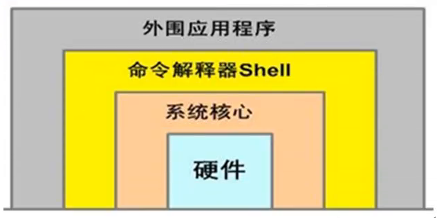

# Bash Shell编程指南之基础

## 什么是Shell？

`shell`是一个命令解释器，它在操作系统的最外层，负责直接与用户对话，把用户的输入解释给操作系统，并处理各种各样的操作系统的输出结果，输出到屏幕返回给用户。这种对话方式可以是交互的方式（从键盘输入命令，可以立即得到shell的回应），或非交互式（脚本）的方式。



## 什么是Shell脚本？

当Linux命令或语句不在命令行下执行（严格说，命令行执行的语句也是`Shell`脚本），而是通过一个程序文件执行时，该程序被称为shell脚本或shell程序，shell程序很类似DOS系统下的批处理程序（扩展名`*.bat`）。用户可以在shell脚本中敲入一系列的命令及命令语句组合，这些命令、变量和流程控制语句等有机的结合起来就形成了一个功能强大的shell脚本。

- 范例1.1 清除/var/log下的messages日志文件内容的交单命令脚本

```bash
# Version 1
cd /var/log/ 
cat /dev/null > messages
echo "Logs cleaned up."
```

> `/var/log/messages`是系统日志文件，很重要.

小结：

1. 上面的脚本，如果不是root就无法执行清理日志;
2. 没有任何的流程控制语句，简单的说就是顺序操作，没有程序判断和逻辑性;
3. 把所有命令放在一个文件里堆积起来就形成了脚本;

- 范例1.2 包含命令、变量和流程控制语句的清除/var/log下messages日志文件的shell脚本

```bash
#!/bin/bash
# Version 2
LOG_DIR=/var/log
ROOT_UID=0    #$UID为0的时候，用户才具有root用户的权限

if [ "$UID" -ne "$ROOT_UID" ]  # 判断是否是root用户，如果不是，给出提示并退出程序
then
	echo "Must be root run this script."
	exit 1
fi

cd $LOG_DIR || {  # 如果切换目录不成功则给出提示
	echo "Cannot changeto necessary directory" >&2
	exit 1
}

# 用户即是root，目录也存在的时候在清空文件内容，并给出提示
cat /dev/null > messages && echo "Logs cleaned up."
exit 0  # 退出之前返回0表示成功. 返回1表示失败
```

- 查看系统的SHELL

```bash
$ cat /etc/shells 
/bin/sh
/bin/bash
/sbin/nologin
/bin/dash
/bin/tcsh
/bin/csh
```

- 查看当前SHELL

```bash
$ echo $SHELL
/bin/bash
$ head -1 /etc/passwd
root:x:0:0:root:/root:/bin/bash  # 以:分割，最后一列就是用户登录时的shell
```

- 查看当前SHELL的版本

```bash
$ echo $BASH_VERSION
4.4.5(1)-release
```

## 创建与执行Shell脚本

- 创建

在Linux系统中，shell脚本通常是在编辑器（如`vi/vim`）中编写，由`Unix/Linux`命令、`bash shell`命令、`程序结构控制`语句和`注释`等内容组成，推荐用`vi/vim`编辑器.

- 脚本开头

一个规范的shell脚本的第一行会指出由那个程序（解释器）来执行脚本中的内容，在`Linux bash`编程中一般为：

```bash
#!/bin/bash
或
#!/bin/sh <==255个字符以内
```
其中开头的`#!`又称为幻术，在执行bash脚本的时候，内核会根据`#!`后的解释器来确定应该使用那个程序解释脚本中的内容，注意：这一行必须在每个脚本顶端的第一行，如果不是第一行则为脚本注释行，例如下面的列子：

```bash
$ cat test.sh 
#!/bin/bash
echo "Linux start"
#!/bin/bash	写到这里就是注释了
echo "Linux end"
```

- 注释

在shell脚本中，跟在(#)井号后面的内容表示注释，用来对脚本进行注释说明，注释部分不会被当作程序执行，仅仅是给用户看的，系统解释器是看不到的更不会执行，注释可自从一行，也可以跟在脚本命令后面与命令在同一行。开发脚本时，如果没有注释，团队里的其他人就很难理解脚本究竟在做什么，如果时间长了自己也会忘记。因此，我们要尽量养成为所开发的shell脚本书写注释的习惯，书写注意不光是方便别人，也是方便自己，否则，写完一个脚本后也许几天后就不记得脚本的用途了，需要时再重新阅读也会浪费很多宝贵的时间，特别是影响团队的写作效率，以及后来接手维护的人带来维护困难，注释尽量不要中文。

```bash
#!/bin/bash
# 我是注释
```

- shell脚本的执行

当shell脚本以非交互式的方式（文件方式）运行时，它会先查找环境变量ENV，该变量指定了一个环境文件（通常是`.bashrc,.bash_profile,/etc/bashrc,/etc/profile`），然后从该环境变量文件开始执行，当读取了ENV文件后，SHELL才开始执行shell脚本中的内容。

**Shell脚本的执行通常可以采用以下三种方式**

1. `bash script-name`或`sh script-name`	（推荐使用）
2. `path/script-name`或`./script-name`	（当前路径下执行脚本）
3. `source script-name`或`.script-name`	（注意“.“点号）
4. `sh<script-name`或`cat test.sh|sh`	（同样适合bash）

**执行说明：**
1. 第一种方法是当脚本文件本身没有可执行权限时常使用的方法，这里推荐用bash执行，或者文件开头没有指定解释器。
2. 第二种方法需要先将脚本文件的权限改为可执行文件，然后通过脚本路径就可以直接执行脚本了。
3. 第三种方法通常使用`source`或者`.`点好读入或加载指定的shell脚本文件（如san.sh），然后，依次执行指定shell脚本文件`san.sh`中的所有语句。这些语句将作为当前父shell脚本`fathe.sh`进程的一部分运行。因此，使用source或者`.`可以将`san.sh`自身脚本中的变量的值或函数等的返回值传递到当前的父shell脚本`father.sh`中使用，这是第三种方法和前两种方法的最大区别，也是值得关注的。
4. `source`或`.`点号命令的功能是在当前shell中执行`source`或者`.`点好加载并执行的相关脚本文件中的命令及语句，而不是产生一个子shell来执行命令文件中的命令。

## shell脚本开发基本规范及习惯

- 脚本第一行指定脚本解释器

```bash
#!/bin/bash或者#!/bin/sh
```

- 脚本开头加版本版权等信息

```bash
# Date:		2017-05-31 14:19:35
# Author:	Created by Natasha
# mail:		ianshengme.com
# Function:	this scripts function is..
# Version:	1.0
```

> 可配置vim编辑文件时自动加上以上信息，方法是修改~/.vimrc配置文件

- 脚本中不使用中文注释

尽量用英文注释，防止本机或切换系统环境后中文乱码的困扰。

- 脚本以.sh为扩展名

例如：`script-name.sh`

- 代码书写优秀习惯

1. 成对的符号内容尽量一次写出来，防止遗漏。如：`{}、[]、’’、``、””`
2. `[]`中括号两端要有空格，书写是即可流出空格`[  ]`,然后在退格书写内容，先书写一对中括号，然后退一格，然后再输入两个空格，再退一个格。
3. 流程控制语句一次书写完，再添加内容。

- 通过缩进让代码易读

```bash
if 条件内容
then
	内容
fi
```

> 好的习惯可以让我们避免很多不必要的麻烦，提升很多的工作效率