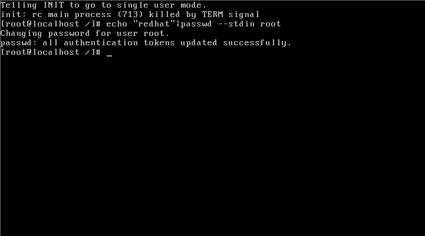

# CentOS6.6忘记密码强制破密详细过程

1、在系统启动的时候会出现`3、2、1`倒数，在这个界面按任意键进入启动菜单

2、底部的操作说明大意：使用上下方向键选择操作对象，选中直接敲回车会启动操作系统，按`“e”`（edit的简写）即为进入编辑命令，按`“a”`是修改系统内核参数，`“c”`是进入命令行，这里我们按`“e”`。

3、选择第二个，按`” e”`

4、空格输入`“1”`，然后回车

5、返回这个界面按` “b”`

6、正在加载

7、进去之后直接设置root没密码，然后重启用刚才设置的密码登陆即可。

