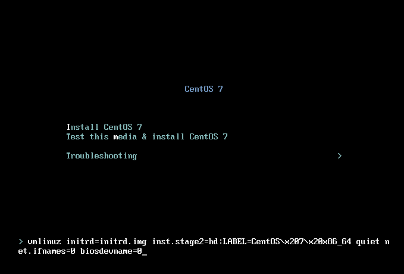

# CentOS7修改默认网卡名称为eth0

CentOS7默认的网卡名称是和设备名称是随机的，如果要修改网卡名称以`eth`开头，有两种方式

## 第一种方式

这种方式适合在安装操作系统的时候进行设置，

点击 Tab，打开kernel启动选项，


增加内核参数：`net.ifnames=0` `biosdevname=0`



输入完成之后回车正常安装操作系统就好了。

## 第二种方式

修改网卡配置文件中的`DEVICE=`参数的关于`eth0`

```bash
[root@ansheng ~]# cd /etc/sysconfig/network-scripts/
[root@ansheng network-scripts]# vi ifcfg-eno16777728
TYPE=Ethernet
BOOTPROTO=dhcp
DEFROUTE=yes
PEERDNS=yes
PEERROUTES=yes
IPV4_FAILURE_FATAL=no
IPV6INIT=yes
IPV6_AUTOCONF=yes
IPV6_DEFROUTE=yes
IPV6_PEERDNS=yes
IPV6_PEERROUTES=yes
IPV6_FAILURE_FATAL=no
NAME=eno16777728
UUID=8a3eade8-005c-46df-81f2-6e2598457bac
#DEVICE=eno16777728
DEVICE=eth0
ONBOOT=yes
```

网卡配置文件名称改为`ifcfg-eth0`

```bash
[root@ansheng network-scripts]# mv ifcfg-eno16777728 ifcfg-eth0
```

因`CentOS7`采用`grub2`引导，还需要对`grub2`进行修改，编辑`/etc/default/grub`配置文件，在`GRUB_CMDLINE_LINUX`这个参数后面加入`net.ifnames=0 biosdevname=0`

```bash
[root@ansheng network-scripts]# vi /etc/default/grub
GRUB_TIMEOUT=5
GRUB_DISTRIBUTOR="$(sed 's, release .*$,,g' /etc/system-release)"
GRUB_DEFAULT=saved
GRUB_DISABLE_SUBMENU=true
GRUB_TERMINAL_OUTPUT="console"
GRUB_CMDLINE_LINUX="rd.lvm.lv=centos/root rd.lvm.lv=centos/swap rhgb quiet net.ifnames=0 biosdevname=0"
GRUB_DISABLE_RECOVERY="true"
```

用`grub2-mkconfig`命令重新生成GRUB配置并更新内核

```bash
[root@ansheng network-scripts]# grub2-mkconfig -o /boot/grub2/grub.cfg
Generating grub configuration file ...
Found linux image: /boot/vmlinuz-3.10.0-327.el7.x86_64
Found initrd image: /boot/initramfs-3.10.0-327.el7.x86_64.img
Found linux image: /boot/vmlinuz-0-rescue-4dd6b54f74c94bff9e92c61d669fc195
Found initrd image: /boot/initramfs-0-rescue-4dd6b54f74c94bff9e92c61d669fc195.img
done
```

重启系统

```bash
[root@ansheng network-scripts]# reboot 
```

重启之后验证网卡名称:

```python
[root@ansheng ~]# ifconfig 
eth0: flags=4163<UP,BROADCAST,RUNNING,MULTICAST>  mtu 1500
        inet 192.168.56.130  netmask 255.255.255.0  broadcast 192.168.56.255
        inet6 fe80::20c:29ff:fe6d:d894  prefixlen 64  scopeid 0x20<link>
        ether 00:0c:29:6d:d8:94  txqueuelen 1000  (Ethernet)
        RX packets 27413  bytes 38532163 (36.7 MiB)
        RX errors 0  dropped 0  overruns 0  frame 0
        TX packets 7727  bytes 702194 (685.7 KiB)
        TX errors 0  dropped 0 overruns 0  carrier 0  collisions 0

lo: flags=73<UP,LOOPBACK,RUNNING>  mtu 65536
        inet 127.0.0.1  netmask 255.0.0.0
        inet6 ::1  prefixlen 128  scopeid 0x10<host>
        loop  txqueuelen 0  (Local Loopback)
        RX packets 0  bytes 0 (0.0 B)
        RX errors 0  dropped 0  overruns 0  frame 0
        TX packets 0  bytes 0 (0.0 B)
        TX errors 0  dropped 0 overruns 0  carrier 0  collisions 0
```