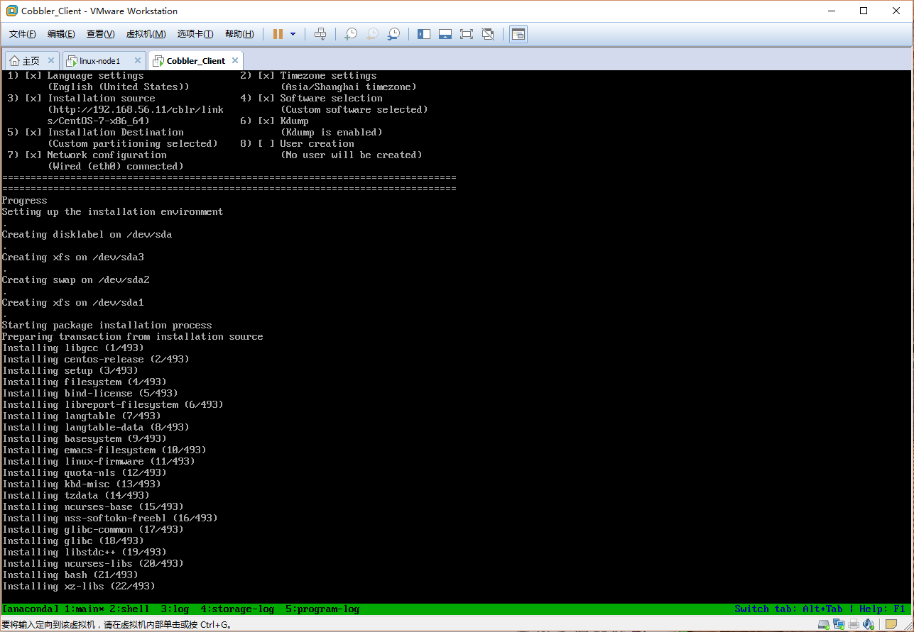
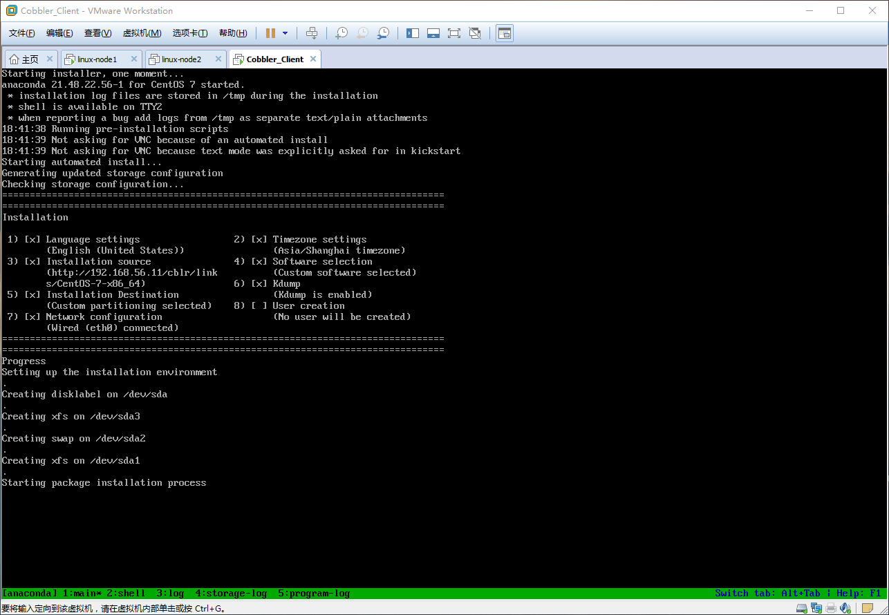

# Cobbler定制安装及重装系统

获取帮助

```bash
[root@linux-node1 ~]# cobbler system add --help
```

定制安装意思就是我可以通过`MAC`地址给指定的机器安装系统，而且安装完成之后还可以对服务器做一些相对应的操作，那么我们上一篇文章最后已经安装了一台`CentS-7`的系统，那么我们现在就把这才系统给重装了，意思就是`CentOS-7`这台机器再重启之后会自动安装，并且`主机名`、`IP`等信息已经配置好了。

首先在`CentOS-7`这台机器上面获取网卡的MAC地址

```bash
[root@localhost ~]# ifconfig eth0
eth0: flags=4163<UP,BROADCAST,RUNNING,MULTICAST>  mtu 1500
        inet 192.168.56.138  netmask 255.255.255.0  broadcast 192.168.56.255
        inet6 fe80::20c:29ff:feef:129e  prefixlen 64  scopeid 0x20<link>
        ether 00:0c:29:ef:12:9e  txqueuelen 1000  (Ethernet)
        RX packets 440  bytes 171477 (167.4 KiB)
        RX errors 0  dropped 0  overruns 0  frame 0
        TX packets 187  bytes 24788 (24.2 KiB)
        TX errors 0  dropped 0 overruns 0  carrier 0  collisions 0
```

`MAC`地址就是`00:0c:29:ef:12:9e`

注意以下操作就是`Cobbler`服务端上面进行操作了

```bash
[root@linux-node1 ~]# cobbler system add --name=linux-node2.example.com --mac-address=00:0c:29:ef:12:9e --profile=CentOS-7-x86_64 --ip-address=192.168.56.12 --subnet=255.255.255.0 --gateway=192.168.56.2 --interface=eth0 --static=1 --hostname=linux-node2.example.com --name-servers=192.168.56.2 --kickstart=/var/lib/cobbler/kickstarts/CentOS-7-x86_64.cfg
```

```bash
[root@linux-node1 ~]# cobbler system list
   # 这就是我们刚才添加的那台机器
   linux-node2.example.com
```

重新启动`CentOS-7`这台机器，然后从网卡启动，启动之后会自动获取IP地址进行重装




安装完成后记得把启动模式调回硬盘启动哦，要不然又要无限制重装了

登陆系统验证配置信息

```bash
Last failed login: Sun May 29 16:10:54 CST 2016 from 192.168.56.1 on ssh:notty
There was 1 failed login attempt since the last successful login.
Last login: Sun May 29 16:10:07 2016
[root@linux-node2 ~]# hostname
linux-node2.example.com
[root@linux-node2 ~]# cat /etc/resolv.conf 
# Generated by NetworkManager
search example.com
nameserver 192.168.56.2
[root@linux-node2 ~]# cat /etc/redhat-release 
CentOS Linux release 7.2.1511 (Core) 
[root@linux-node2 ~]# cat /etc/sysconfig/network-scripts/ifcfg-eth0 
# Generated by dracut initrd
NAME="eth0"
HWADDR=00:0C:29:EF:12:9E
ONBOOT=yes
NETBOOT=yes
UUID="6fb9ae6d-4a89-4d75-b201-045630b5e76e"
IPV6INIT=yes
BOOTPROTO=none
TYPE=Ethernet
DNS1=192.168.56.2
DEFROUTE=yes
IPV4_FAILURE_FATAL=no
IPV6_AUTOCONF=yes
IPV6_DEFROUTE=yes
IPV6_FAILURE_FATAL=no
IPADDR=192.168.56.12
PREFIX=24
GATEWAY=192.168.56.2
IPV6_PEERDNS=yes
IPV6_PEERROUTES=yes
[root@linux-node2 ~]# ifconfig 
eth0: flags=4163<UP,BROADCAST,RUNNING,MULTICAST>  mtu 1500
        inet 192.168.56.12  netmask 255.255.255.0  broadcast 192.168.56.255
        inet6 fe80::20c:29ff:feef:129e  prefixlen 64  scopeid 0x20<link>
        ether 00:0c:29:ef:12:9e  txqueuelen 1000  (Ethernet)
        RX packets 219  bytes 40464 (39.5 KiB)
        RX errors 0  dropped 0  overruns 0  frame 0
        TX packets 165  bytes 23647 (23.0 KiB)
        TX errors 0  dropped 0 overruns 0  carrier 0  collisions 0

lo: flags=73<UP,LOOPBACK,RUNNING>  mtu 65536
        inet 127.0.0.1  netmask 255.0.0.0
        inet6 ::1  prefixlen 128  scopeid 0x10<host>
        loop  txqueuelen 0  (Local Loopback)
        RX packets 4  bytes 340 (340.0 B)
        RX errors 0  dropped 0  overruns 0  frame 0
        TX packets 4  bytes 340 (340.0 B)
        TX errors 0  dropped 0 overruns 0  carrier 0  collisions 0
```

## 重装

当我们把客户机安装好之后如果要进行客户机重装， 那么就需要以来一个软件包`koan`。

在客户机上安装koan软件包

```bash
[root@linux-node2 ~]# yum -y install koan
# 默认的yum源是国外的，如果不能使用请配置成可用的yum源
```

获取`cobbler`服务端可以选择重装的`profile(ks)`

```bash
[root@linux-node2 ~]# koan --server=192.168.56.11 --list=profiles
- looking for Cobbler at http://192.168.56.11:80/cobbler_api
CentOS-7-x86_64
CentOS-6-x86_64
```

制定重装成`CentOS-6-x86_64`

```bash
[root@linux-node2 ~]# koan --replace-self --server=192.168.56.11 --profile=CentOS-6-x86_64
[root@linux-node2 ~]# reboot 
```
最后重启系统网卡启动就会自动安装了，注意安装的时候是不需要选择的


正在安装



安装完成之后记得把取消网卡自动启动哦，避免重装。