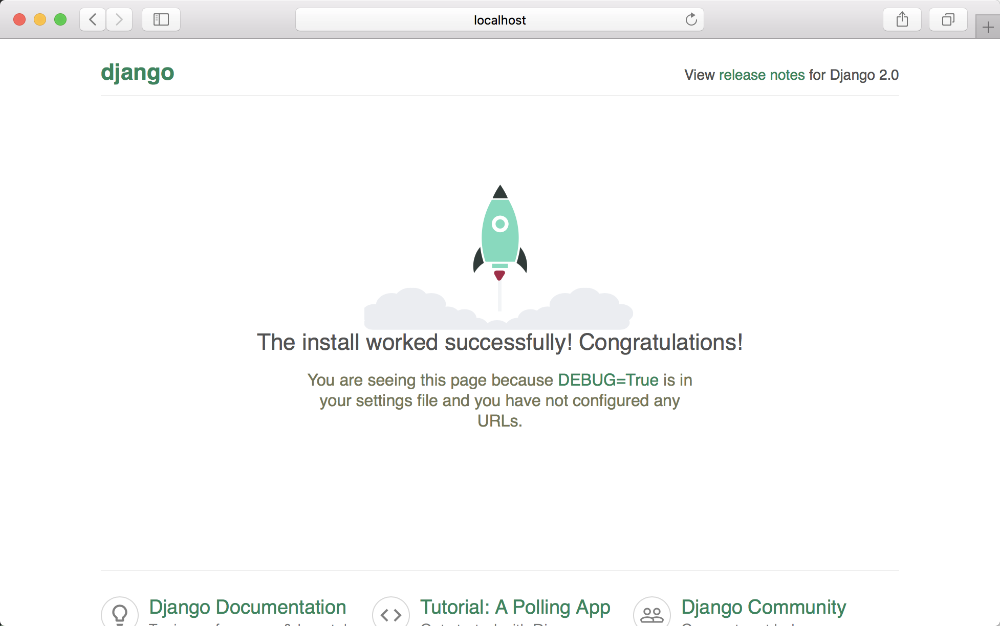

# Docker部署Django项目

重点如文章`title`所述，利用`Docker`实际部署`Django`项目，一些非常典型的应用都包含在里面了，比如：

1. `Proxy`用的`Nginx`
2. 数据库用的`postgres`
3. 异步任务`celery+redis`也是必须存在的

我觉得这些在大多数项目中都是够用了的，如果你实际的项目用到了其他的东西，不妨[告诉我](https://github.com/anshengme/docker-deploy-django/issues)一下，我会尽快的添加到其中。

文章不会做太多的描述，所有的代码放在GitHub上面：https://github.com/anshengme/docker-deploy-django

- 环境介绍

本机的环境是`macOS`，docker相关环境如下：

```bash
$ docker version
Client:
 Version:      17.09.1-ce
 API version:  1.32
 Go version:   go1.8.3
 Git commit:   19e2cf6
 Built:        Thu Dec  7 22:22:25 2017
 OS/Arch:      darwin/amd64

Server:
 Version:      17.09.1-ce
 API version:  1.32 (minimum version 1.12)
 Go version:   go1.8.3
 Git commit:   19e2cf6
 Built:        Thu Dec  7 22:28:28 2017
 OS/Arch:      linux/amd64
 Experimental: true
$ docker-compose -v
docker-compose version 1.17.1, build 6d101fb
```

请确保你已经安装好了[docker-compose](https://github.com/docker/compose)，如果你拉取镜像的时候巨慢，你可以访问[docker中国](https://www.docker-cn.com/registry-mirror)更换源进行加速.

## 快速开始

- 下载项目

```bash
$ git clone git@github.com:anshengme/docker-deploy-django.git
```

- 进入目录

```bash
$ cd docker-deploy-django
```

- 启动

```bash
$ docker-compose up
```

下面是启动的截图


- 访问

打开浏览器，访问：`http://localhost:9999`，截图如下：



我好向不会告诉你具体哪一步如何操作是什么意思，因为我觉得你可以通过GitHub上的[源码](https://github.com/anshengme/docker-deploy-django)来进行学习。

## 参考文献

- [Quickstart: Compose and Django](https://docs.docker.com/compose/django/)
- [Deploy Django, Gunicorn, NGINX, Postgresql using Docker](http://ruddra.com/2016/08/14/docker-django-nginx-postgres/index.html)
- [Docker: Use Celery in Django(Redis as Broker)](http://ruddra.com/2016/11/14/docker-do-stuff-using-celery-using-redis-as-broker/)
