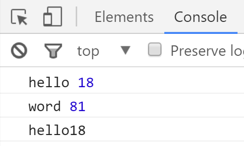

# JavaScript函数

## 基本函数

函数是一块JavaScript代码，被定义一次，但可执行和调用多次。 

JS中的函数也是对象，所以JS函数可以像其它对象那样操作和传递所以我们也常叫JS中的函数为函数对象。

函数又可以大致分为三类：`普通函数、匿名函数、自执行函数`

### 普通函数

语法

```javascript
function 函数名() {
    代码块;
};
```

实例

```javascript
// 创建一个函数func并接受一个参数arg
function func(arg) {
    // 输出参数内容
    console.log(arg);
    // 返回参数内容
    return arg;
};
// 执行func函数，传入"as"这个参数
func("as");
```

输出为：`as`

### 匿名函数

语法

```javascript
var 函数名 = function(接受的参数) {
    代码块;
};
```

实例

```javascript
var func = function(arg) {
    console.log(arg);
    return arg;
};
func("hello");
```
输出结果：`hello`

### 自执行函数

语法

```javascript
(function(参数) {
    代码块;
})(传入的参数);
```

实例

```javascript
// 接受一个参数
(function(arg) {
    // 输出参数内容
    console.log(arg);
    // 传入参数'hello world'
})('hello world');
```

输出为：`hello world`


函数参数个数例子

函数在传参的时候，可以少传或者多传入

```javascript
(function(arg, arg2) {
    // 如果只传入一个参数那么这个参数就等于undefined
    console.log(arguments);
    console.log(arg,arg2);
})('hello world');
```
结果为：`hello world undefined`


## 作用域

JavaScript中每个函数都有自己的作用域，当出现函数嵌套时，就出现了作用域链，当内层函数使用变量时，会根据作用域链从内到外一层层的循环，如果不存在，则异常。

切记：所有的作用域在创建函数且未执行时候就已经存在。


```javascript
// 定义变量name=as
name = "as";
// 创建一个函数f1
function f1() {
    // 定义一个局部变量name=a
    var name = "a";
    // 创建一个函数f2
    function f2() {
        // 输出一个name的值
        console.log(name);
    }
    // 执行f2函数
    f2();
}
// 执行f2函数
f1();
```
输出为：`a`

类似装装饰器的例子

```javascript
name = "as";
// f1函数的作用于就是全局
function f1() {
    var name = "a";
    // 创建一个函数f2,f2的父作用于就是f2，定死了的
    function f2() {
        console.log(name);
    }
    // 把f2 return出去，相当于装饰器
    return f2
}
// 相当于把f2函数复制给ret,此时的ret父作用于还是f1
var ret = f1();
// 相当于执行f2函数
ret();
```
输出为：`a`


声明提前

在JavaScript引擎"预编译"时进行，例如：

```javascript

// 当遇到这个函数的时候会把函数放内存中，但是不执行里面的代码，只声明变量
function f(){
    console.log(name);
    // 创建按函数的时候对变量进行声明，相当于占个坑，但是不赋值，相当于var name;
    var name = "as";
};
// 但调用函数的时候才执行var name = "as";
f();
```
输出结果为：`undefined`

五句话搞定JavaScript作用域:
http://www.cnblogs.com/wupeiqi/p/5649402.html

## 闭包

闭包是函数里面嵌套函数，记住函数里面所有的状态。

```javascript
// 创建一个函数f1
function f1() {
    // 创建一个
    var arg = "hello world";
    // 创建一个函数f1，父级是f1，作用域只有在f1内
    function f2() {
        // 输出f1的值
        console.log(arg);
    }
    // 把f2返回出去
    return f2;
}
// 相当于ret = f2();
ret = f1();
// 相当于执行f2();
ret();
```
输出结果:`hello world`

## 面向对象

`JavaScript`里面虽然没有类，但是有函数，可以用函数来充当类，下面的例子就演示了面向对象的实现：

```javascript
// 等价于创建了一个类，还有构造方法
function Foo(name, age) {
    // this等价于Python中的self
    this.Name = name;
    this.Age = age;
    this.Func = function() {
        console.log(this.Name + this.Age);
    };
};

// 根据类创建对象的时候需要加上new关键字
obj1 = new Foo("hello", 18);
obj2 = new Foo("word", 81);

// 输出obj1.Name, obj1.Age
console.log(obj1.Name, obj1.Age);
console.log(obj2.Name, obj2.Age);
// 执行类的方法
obj1.Func();
```
输出结果如图：



上面代码中每个对象中均保存了一个相同的Func函数，从而浪费内存，使用原型和可以解决该问题：

```javascript
function Foo(name, age) {
    this.Name = name;
    this.Age = age;
};

Foo.prototype = {
    Func: function() {
        console.log(this.Name + this.Age);
    },
};

// 上面的代码中也可以这样写
// Foo.prototype.Func = function() {
//     console.log(this.Name + this.Age);
// }

obj = new Foo("hello", 18);
obj.Func();
```
输出结果:`hello18`