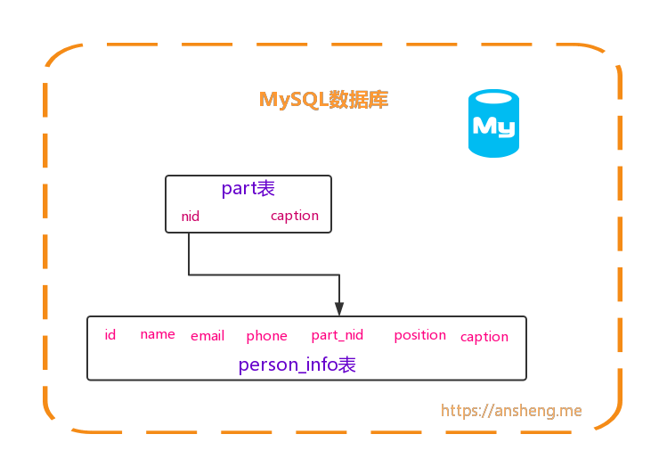

# Python全栈之路系列之MySQL外键

先来个例子来说明什么是外键以及外键的作用，so，`XO公司`现正处于一种迅速发展的状态，从最初的12人的团队发展到现在的300人，那么问题就来了，发展的越快，人员与部门就越来越多，这是老大要求我们做一个人员管理系统，用于查询入职人员的信息等。

起初我们想用一个表来实现所有的人员统计，创建`Personnel`库,用于存放公司员工的信息，指令如下：

```sql
CREATE DATABASE personnel DEFAULT CHARSET utf8 COLLATE utf8_general_ci;
```
然后在创建一个人员信息表，在这个`person_info`表中，`id`和`name`列是联合主键，引擎是`InnoDB`，字符集是`utf8`格式的
```sql
CREATE TABLE `person_info` (
  -- 人员ID
  `id` int(11) NOT NULL AUTO_INCREMENT,
  -- 人员姓名
  `name` varchar(10) NOT NULL,
  -- email
  `email` varchar(15) DEFAULT NULL,
  -- 手机号码
  `phone` char(11) NOT NULL,
  -- 部门
  `department` varchar(32) DEFAULT NULL,
  -- 职位
  `position` varchar(30) DEFAULT NULL,
  -- 说明描述
  `caption` varchar(255) DEFAULT NULL,
  PRIMARY KEY (`id`,`name`)
) ENGINE=InnoDB AUTO_INCREMENT=6 DEFAULT CHARSET=utf8;

```
插入成员数据
```sql
INSERT INTO person_info(name,email,phone,department,position,caption) VALUES ('a', 'a@anshengme.com', '13800138000', 'XO股份有限公司公司-技术部-Python开发', 'Python API开发', '我是一名Python开发工程师，专注于PYthon API开发');
INSERT INTO person_info(name,email,phone,department,position) VALUES ('b', 'b@anshengme.com', '13800138000', 'XO股份有限公司公司-技术部-JAVA开发', 'JAVA APP开发');
INSERT INTO person_info(name,email,phone,department,position) VALUES ('c', 'c@anshengme.com', '13800138000', 'XO股份有限公司公司-技术部-前端', 'JavaScript');
INSERT INTO person_info(name,email,phone,department,position) VALUES ('d', 'd@anshengme.com', '13800138000', 'XO股份有限公司公司-技术部-DBA', 'MySQL DBA');
INSERT INTO person_info(name,email,phone,department,position) VALUES ('e', 'e@anshengme.com', '13800138000', 'XO股份有限公司公司-技术部-服务器组', 'Linux');
```
查看插入的数据
```bash
mysql> select * from person_info;
+----+------+-----------------+-------------+---------------------------------------------------+------------------+---------------------------------------------------------------+
| id | name | email           | phone       | department                                        | position         | caption                                                       |
+----+------+-----------------+-------------+---------------------------------------------------+------------------+---------------------------------------------------------------+
|  1 | a    | a@anshengme.com | 13800138000 | XO股份有限公司公司-技术部-Python开发              | Python API开发   | 我 是一名Python开发工程师，专注于PYthon API开发                |
|  2 | b    | b@anshengme.com | 13800138000 | XO股份有限公司公司-技术部-JAVA开发                | JAVA APP开发     | NULL                                                          |
|  3 | c    | c@anshengme.com | 13800138000 | XO股份有限公司公司-技术部-前端                    | JavaScript       | NULL                                                          |
|  4 | d    | d@anshengme.com | 13800138000 | XO股份有限公司公司-技术部-DBA                     | MySQL DBA        | NULL                                                          |
|  5 | e    | e@anshengme.com | 13800138000 | XO股份有限公司公司-技术部-服务器组                | Linux            | NULL                                                          |
+----+------+-----------------+-------------+---------------------------------------------------+------------------+---------------------------------------------------------------+
5 rows in set (0.00 sec)
```
so，我们只是插入了上面5条数据而已，那么如果有成千上万条的数据，`department`是不是都是重复的呢？因为么个人肯定都是属于一个部门的，还可能属于这个部门下面某个组的，而且上面的部门字段所占用的字符只有这个么几个，如果有个变态的老大，必须把部门名车个搞到很长很长，那么这样做是不是很占用空间呢？而且查询的时候也没有那么快。

所以，外键的作用就出来了，那么现在的表设计就改变了，变成什么样的呢？

`person_info`表被拆封成两个表，分为`part部门表`和`person_info人员信息表`，

`part`表有`nid`和`caption`列，`nid`为主键并自增，`caption`存放公司所有的部门等。

`person_info`依旧是人员信息表，拥有的字段和上面表中的设置是一样的，`id`和`name`依旧是主键，`id`自增，唯一改变的就是`part_nid`列关联了`part`表中的`nid`列，表设计如下图：



先删除之前创建的`person_info`表
```sql
DROP TABLE person_info;
```
创建`part`职务表
```sql
CREATE TABLE part (
  nid int(11) NOT NULL AUTO_INCREMENT,
  caption varchar(32) NOT NULL,
  PRIMARY KEY (nid)
) ENGINE=InnoDB DEFAULT CHARSET=utf8;
```
插入部门数据
```sql
INSERT INTO part(caption) VALUES("XO股份有限公司公司-技术部-JAVA开发"),("XO股份有限公司公司-技术部-前端"),("XO股份有限公司公司-技术部-DBA"),("XO股份有限公司公司-技术部-服务器组"),("XO股份有限公司公司-技术部-Python开发");
```
查看插入的部门信息
```bash
mysql> select * from personnel.part;
+-----+---------------------------------------------------+
| nid | caption                                           |
+-----+---------------------------------------------------+
|   1 | XO股份有限公司公司-技术部-JAVA开发                |
|   2 | XO股份有限公司公司-技术部-前端                    |
|   3 | XO股份有限公司公司-技术部-DBA                     |
|   4 | XO股份有限公司公司-技术部-服务器组                |
|   5 | XO股份有限公司公司-技术部-Python开发              |
+-----+---------------------------------------------------+
5 rows in set (0.00 sec)
```
创建`person_info`人员信息表
```sql
CREATE TABLE `person_info` (
  `nid` int(11) NOT NULL AUTO_INCREMENT,
  `name` char(10) NOT NULL,
  `email` varchar(20) NOT NULL,
  `phone` char(11) NOT NULL,
  `part_nid` int(11) NOT NULL,
  `position` char(20) NOT NULL,
  `caption` varchar(255) DEFAULT NULL,
  PRIMARY KEY (`nid`,`name`)
) ENGINE=InnoDB DEFAULT CHARSET=utf8;
```

设置外键

把`person_info`表中的`part_nid`列和`part`表中的`nid`列做一个外键关联，外键的名称为`person_ibfk_1`

```sql
alter table person_info add constraint person_ibfk_1 foreign key person_info(`part_nid`) REFERENCES part(`nid`);
```

删除外键

删除`person_info`表中的`person_ibfk_1`外键

```sql
alter table person_info drop foreign key person_ibfk_1;
```

往成员表中插入6条数据

```sql
INSERT INTO person_info (
	NAME,
	email,
	phone,
	part_nid,
	position
)
VALUES
	(
		"as",
		"as@anshengme.com",
		13800138000,
		5,
		"Python"
	),
	(
		"ansheng",
		"as@anshengme.com",
		13800138000,
		5,
		"Python"
	),
	(
		"a",
		"as@anshengme.com",
		13800138000,
		5,
		"Python"
	),
	(
		"v",
		"as@anshengme.com",
		13800138000,
		5,
		"Python"
	),
	(
		"b",
		"as@anshengme.com",
		13800138000,
		5,
		"Python"
	),
	(
		"w",
		"as@anshengme.com",
		13800138000,
		5,
		"Python"
	)
```

上面插入的数据都是合法的，那么如果我们插入不合法的数据会怎样呢？比如说插入一条在`part`表中不存在的部门会怎样？

```bash
mysql> use personnel;
Database changed
mysql> INSERT INTO person_info(name,email,phone,part_nid,position) VALUES("pwd","pwd@anshengme.com",13800138000,10,"Python");
ERROR 1452 (23000): Cannot add or update a child row: a foreign key constraint fails (`personnel`.`person_info`, CONSTRAINT `person_ibfk_1` FOREIGN KEY (`part_nid`) REFERENCES `part` (`nid`))
```
so，是不是就报错了呢？没做，这就是外键的约束，如果说你插入的数据中，`part_nid`列中的数据在`part`表的`nid`列没有的话，那么是万万不可以的,

上述是`一对多`的关系，多对多和连表查询会在下一篇文章中介绍，其实很简单