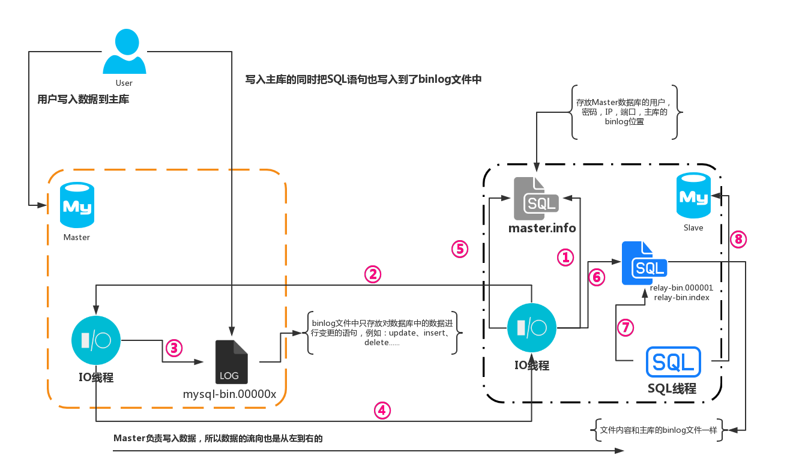

# MySQL的主从复制是如何实现的

## 前言

MySQL的主从复制是MySQL本身自带的一个功能，不需要额外的第三方软件就可以实现，其复制功能并不是copy文件来实现的，而是借助binlog日志文件里面的SQL命令实现的主从复制，可以理解为我再Master端执行了一条SQL命令，那么在Salve端同样会执行一遍，从而达到主从复制的效果。

## MySQL主从复制架构图

一主一从

一主多从

级联

双主一从

互为主从

环状

## 主从复制原理解刨

MySQL的主从复制是一个异步的复制过程，数据库从一个Master复制到Slave数据库，在Master与Slave之间实现整个主从复制的过程是由三个线程参与完成的，其中有两个线程(SQL线程和IO线程)在Slave端，另一个线程(IO线程)在Master端，具体的流程图如下：

**文字解释**

再解释MySQL主从复制之前我们需要先启动Master数据库然后再启动Salve数据库，然后在Salve数据库中执行`start slave;`，执行完成之后，流程就如下了：

1. Salve的IO线程会读取mastr.info文件中配置好的主库信息，比如说存放的有：Master数据库的用户名、密码、端口、还有Master的binlog索引位置；
2. 拿到信息之后就带着信息去链接Master的主库IO线程
3. 当主库的IO线程先检查SLave传过来的配置信息是否正确，如果正确，就拿着Slave传过来的binlog索引位置和Master库的binlog文件中最后一个索引位置进行对比，如果一致就陷入等待状态，等待Master的binlog索引位置更新；
4. 如果不一致就把Slave传过来的binlog索引位置往后的所有SQL语句包括最后一条SQL语句的索引位置发送个给Slave的IO线程；
5. Slave的IO线程拿到信息之后，先把Master传过来的binlog索引在Slave的master.info文件中进行更新；
6. 然后再把Master传过来的SQL语句写入到relay文件中，然后继续循环执行第二个步骤；
7. Slave的SQL线程会一直持续的观察relay日志文件中是否有改动，如果没有就继续监听；
8. 如果发现relay中有变动，那么就获取变动的内容转换为SQL语句，并且把SQL语句在Salve的数据库中进行执行