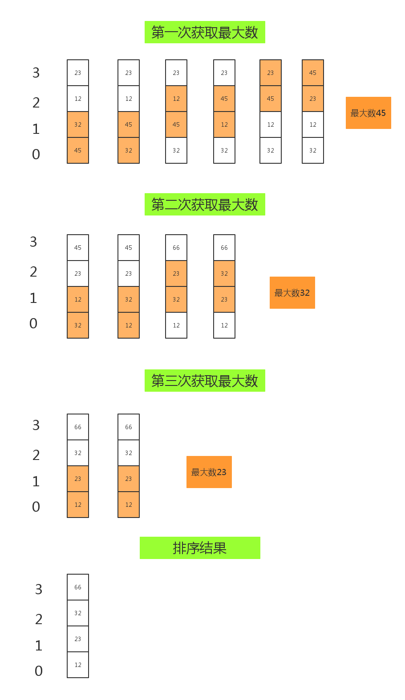

# Python算法实战系列之冒泡

冒泡算法即冒泡排序，其目的就是为一个无序的列表排成有序的，从大到小或从小到大都可以。

## 题外话

- 变量位置的互换

假设现在有两个变量a1与a2：

```python
a1=123
a2=456
```

如何调换这两个变量的位置，即结果就是让`a1=456`，`a2=123`？

解：添加一个中间变量temp，其过程如下：

```python
a1=123
a2=456

print("a1 =",a1," ","a2 =",a2)

temp=a1
a1=a2
a2=temp

print("a1 =",a1," ","a2 =",a2)
```

输出结果为：

```python
C:\Python35\python.exe F:/Python_code/Note/maopao.py
a1 = 123   a2 = 456
a1 = 456   a2 = 123

Process finished with exit code 0
```

- 列表位置的互换

现在有一个列表`li`，内容为：

```python
li = [33, 2, 55, 1]
```

现需要把`li`列表中的第一个位置元素与第二个位置元素互换，其解决方法就可以引用一个中间变量`temp`：

```python
li = [33, 2, 55, 1]
print("原内容为：\n",li)
temp = li[1]
li[1] = li[2]
li[2] = temp
print("互换之后的内容为：\n",li)
```

输出结果：

```python
C:\Python35\python.exe F:/Python_code/Note/maopao.py
原内容为：
 [33, 2, 55, 1]
互换之后的内容为：
 [33, 55, 2, 1]

Process finished with exit code 0
```

## 图解运作原理

列表内容为:

```python
li = [45,32,12,23]
```




## 文字描述

1. 比较相邻的元素，如果第一个比第二个大，就交换他们两个的位置。
2. 对每一对相邻元素作同样的工作，从开始第一对到结尾的最后一对，这步做完后，最后的元素会是最大的数。
3. 针对所有的元素重复以上的步骤，除了最后一个，也就是每次比较之后最大的书不做任何操作。
4. 持续每次对越来越少的元素重复上面的步骤，直到没有任何一对数字需要比较。

## 代码实现

```python
li = [45,32,12,23]
for n in range(1, len(li)):
    for i in range(len(li) - n):
        if li[i] > li[i + 1]:
            temp = li[i]
            li[i] = li[i + 1]
            li[i + 1] = temp
print(li)
```

输出结果：

```python
C:\Python35\python.exe F:/Python_code/Note/maopao.py
[12, 23, 32, 45]

Process finished with exit code 0
```