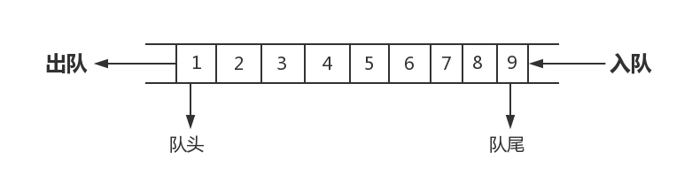

# Python算法实战系列之队列

队列（queue），是先进先出（FIFO, First-In-First-Out）的线性表，在具体应用中通常用链表或者数组来实现，队列只允许在后端（称为rear）进行插入操作，在前端（称为front）进行删除操作，队列的操作方式和堆栈类似，唯一的区别在于队列只允许新数据在后端进行添加。

> 摘录[维基百科](https://zh.wikipedia.org/wiki/%E9%98%9F%E5%88%97)

如图所示



## 队列的接口

一个队列至少需要如下接口：

|接口|描述|
|:--|:--|
|add(x)|入队|
|delete()|出队|
|clear()|清空队列|
|isEmpty()|判断队列是否为空|
|isFull()|判断队列是否未满|
|length()|队列的当前长度|
|capability()|队列的容量|

然而在Python中，可以使用`collections`模块下的`deque`函数，`deque`函数提供了队列所有的接口，那么先让我门看看队列`deque`函数提供了那些API把：

> collections.deque是双端队列，即左右两边都是可进可出的

|方法|描述|
|:--|:--|
|append(x)|在队列的右边添加一个元素|
|appendleft(x)|在队列的左边添加一个元素|
|clear()|从队列中删除所有元素|
|copy()|返回一个浅拷贝的副本|
|count(value)|返回值在队列中出现的次数|
|extend([x..])|使用可迭代的元素扩展队列的右侧|
|extendleft([x..])|使用可迭代的元素扩展队列的右侧|
|index(value, [start, [stop]])|返回值的第一个索引，如果值不存在，则引发ValueError。|
|insert(index, object)|在索引之前插入对象|
|maxlen|获取队列的最大长度|
|pop()|删除并返回最右侧的元素|
|popleft()|删除并返回最左侧的元素|
|remove(value)|删除查找到的第一个值|
|reverse()|队列中的所有元素进行翻转|
|rotate()|向右旋转队列n步（默认n = 1），如果n为负，向左旋转。|

现在我们在Python中测试下这些个API的使用吧。

入队操作

```python
>>> from collections import deque
# 创建一个队列
>>> q = deque([1])
>>> q
deque([1])
# 往队列中添加一个元素
>>> q.append(2)
>>> q
deque([1, 2])
# 往队列最左边添加一个元素
>>> q.appendleft(3)
>>> q
deque([3, 1, 2])
# 同时入队多个元素
>>> q.extend([4,5,6])
>>> q
deque([3, 1, 2, 4, 5, 6])
# 在最左边同时入队多个元素
>>> q.extendleft([7,8,9])
>>> q
deque([9, 8, 7, 3, 1, 2, 4, 5, 6])
```

出队操作

```python
# 删除队列中最后一个
>>> q.pop()
6
>>> q
deque([9, 8, 7, 3, 1, 2, 4, 5])
# 删除队列中最左边的一个元素
>>> q.popleft()
9
>>> q
deque([8, 7, 3, 1, 2, 4, 5])
```

其他的API

```python
# 清空队列
>>> q
deque([8, 7, 3, 1, 2, 4, 5])
>>> q.clear()
>>> q
deque([])
# 判断队列是否为空
>>> not q
True
# 获取队列最大长度
>>> q = deque([1,2], 10)
>>> q.maxlen
10
# 查看某个元素出现的次数
>>> q.extend([1,2,1,1])
>>> q.count(1)
4
# 查看当前队列长度
>>> len(q)
6
# 判断队列是否满了
>>> q.maxlen == len(q)
False
# 队列元素反转
>>> q = deque([1,2,3,4,5],5)
>>> q.reverse()
>>> q
deque([5, 4, 3, 2, 1], maxlen=5)
# 查看元素对应的索引
>>> q.index(1)
4
# 删除匹配到的第一个元素
>>> q
deque([5, 4, 3, 2, 1], maxlen=5)
>>> q.remove(5)
>>> q
deque([4, 3, 2, 1], maxlen=5)
# 元素位置进行旋转
>>> q
deque([4, 3, 2, 1], maxlen=5)
>>> q.rotate(2)
>>> q
deque([2, 1, 4, 3], maxlen=5)
>>> q.rotate(1)
>>> q
deque([3, 2, 1, 4], maxlen=5)
# 使用负数
>>> q.rotate(-1)
>>> q
deque([2, 1, 4, 3], maxlen=5)
```

## 实例

### 二项式系数

**题目**

编写程序，求二项式系数表中(杨辉三角)第K层系列数

```text
   1
  1  1
 1  2  1
1 3  3  1
......
```

**思路**

1. 把第K行的系数存储在队列中
2. 依次出队K层的系数（每行最后一个1不出队），并推算K+1层系数，添加到队尾，最后在队尾添加一个1，便变成了k+1行。

**解决代码**

```python
#!/use/bin/env python
# _*_ coding:utf-8 _*_

from collections import deque

def yanghui(k):
    """
    :param k: 杨辉三角中第几层
    :return: 第K层的系数
    """
    q = deque([1])  # 创建一个队列，默认从1开始
    for i in range(k):  # 迭代要查找的层数
        for _ in range(i):  # 循环需要出队多少次
            q.append(q.popleft() + q[0])  # 第一个数加上队列中第二个数并赋值到队列末尾
        q.append(1)  # 每次查找结束后都需要在队列最右边添加个1
    return list(q)

result = yanghui(3)
print(result)
```

### 划分无冲突子集

**题目**

某动物园搬家，要运走N种动物，老虎与狮子放在一起会大家，大象与犀牛放在一个笼子会打架，野猪和野狗放在一个笼子里会打架，现在需要我们设计一个算法，使得装进同一个笼子的动物互相不打架。

**思路**

1. 把所有动物按次序入队
2. 创建一个笼子(集合)，出队一个动物，如果和笼子内动物无冲冲突则添加到该笼子，有冲突则添加到队尾，等待进入新笼子
3. 由于队列先进先出的特性，如果当前出队动物的index不大于前一个出队动物的index，说明当前队列中所有动物已经尝试过进入且进入不了当前笼子，此时创建信的笼子(集合)

**解决代码**

```python
#!/use/bin/env python
# _*_ coding:utf-8 _*_

from collections import deque

def division(m, n):
    """
    :param m: 冲突关系矩阵
    :param n: 几种动物
    :return: 返回一个栈，栈内包含了所有的笼子
    """
    res = []  # 创建一个栈
    q = deque(range(n))  # 初始化队列，里面放着动物的序号
    pre = n  # 前一个动物的下标

    while q:
        cur = q.popleft()  # 从队头出队一个动物
        if pre >= cur:  # 是否需要创建笼子
            res.append([])  # 创建一个笼子
        # 当前的动物是否与笼子内的动物有冲突
        for a in res[-1]:  # 迭代栈中最顶层的笼子
            if m[cur][a]:  # 有冲突
                q.append(cur)  # 重新放入队列的尾部
                break
        else:  # 当前动物和当前笼子中的所有动物没冲突
            res[-1].append(cur)  # 当前动物放入最上面的笼子中
        pre = cur  # 当前变成之前的
    return res

N = 9
R = {  # 冲突对应关系表
    (1, 4), (4, 8), (1, 8), (1, 7),
    (8, 3), (1, 0), (0, 5), (1, 5),
    (3, 4), (5, 6), (5, 2), (6, 2), (6, 4),
}

M = [[0] * N for _ in range(N)]  # 冲洗关系矩阵M，0代表不冲突
for i, j in R:
    M[i][j] = M[j][i] = 1  # 1代表冲突

result = division(M, N)
print(result)
```

## 数字变换

**题目**

对于一对正整数a,b,对a只能进行加1，减1，乘2操作，问最少对a进行几次操作能得到b？

例如：

1. a=3,b=11: 可以通过3*2*2-1，3次操作得到11；
2. a=5,b=8：可以通过(5-1)*2，2次操作得到8；

**思路**

本题用广度优先搜索，寻找a到b状态迁移最短路径，对于每个状态s，可以转换到撞到s+1,s-1,s*2:

1. 把初始化状态a入队；
2. 出队一个状态s，然后s+1,s-1,s*2入队；
3. 反复循环第二步骤，直到状态s为b；

**解决代码**

```python
#!/use/bin/env python
# _*_ coding:utf-8 _*_

from collections import deque

def atob(a, b):
    """
    :param a: 开始的数字
    :param b: 最终转换之后的数字
    :return: 最小匹配的次数
    """
    q = deque([(a, 0)])  # a=当前数字，0=操作的次数
    checked = {a}  # 已经检查过的数据
    while True:
        s, c = q.popleft()
        if s == b:
            break
        if s < b:  # 要计算的数小于计算之后的数字
            if s + 1 not in checked:  # 如果要计算的数字+1不在已检查过的数据集合中
                q.append((s + 1, c + 1))  # 要计算的数+1，转换次数+1
                checked.add(s + 1)  # 把计算过的数添加到checked集合中
            if s * 2 not in checked:
                q.append((s * 2, c + 1))
                checked.add(s * 2)
        if s > 0:  # 要计算的数大于0
            if s - 1 not in checked:
                q.append((s - 1, c + 1))
                checked.add(s - 1)
    return q.popleft()[-1]

result = atob(3, 11)
print(result)
```