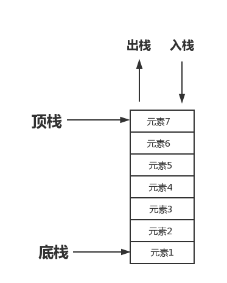
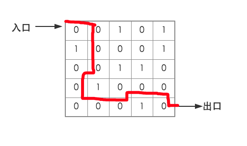

# Python算法实战系列之栈

栈(stack)又称之为堆栈是一个特殊的有序表，其插入和删除操作都在栈顶进行操作，并且按照先进后出，后进先出的规则进行运作。

如下图所示



例如枪的弹匣，第一颗放进弹匣的子弹反而在发射出去的时候是最后一个，而最后放入弹匣的一颗子弹在打出去的时候是第一颗发射出去的。

## 栈的接口

如果你创建了一个栈，那么那么应该具有以下接口来进行对栈的操作

|接口|描述|
|:--|:--|
|push()|入栈|
|pop()|出栈|
|isEmpty()|判断是否为空栈|
|length()|获取栈的长度|
|getTop()|取栈顶的元素，元素不出栈|

知道栈需要上述的接口后，那么在Python中，列表就类似是一个栈，提供接口如下：

|操作|描述|
|:--|:--|
|s = []|创建一个栈|
|s.append(x)|往栈内添加一个元素|
|s.pop()|在栈内删除一个元素|
|not s|判断是否为空栈|
|len(s)|获取栈内元素的数量|
|s[-1]|获取栈顶的元素|

Python中的栈接口使用实例：

```python
# 创建一个栈
In [1]: s = []
# 往栈内添加一个元素
In [2]: s.append(1)

In [3]: s
Out[3]: [1]
# 删除栈内的一个元素
In [4]: s.pop()
Out[4]: 1

In [5]: s
Out[5]: []
# 判断栈是否为空
In [6]: not s
Out[6]: True

In [7]: s.append(1)

In [8]: not s
Out[8]: False
# 获取栈内元素的数量
In [9]: len(s)
Out[9]: 1

In [10]: s.append(2)

In [11]: s.append(3)
# 取栈顶的元素
In [12]: s[-1]
Out[12]: 3
```

## 一大波实例

在了解栈的基本概念之后，让我们再来看几个实例，以便于理解栈。

### 括号匹配

**题目**

假如表达式中允许包含三中括号`()`、`[]`、`{}`，其嵌套顺序是任意的，例如：

正确的格式

```python
{()[()]},[{({})}]
```

错误的格式

```python
[(]),[()),(()}
```

编写一个函数，判断一个表达式字符串，括号匹配是否正确

**思路**

1. 创建一个空栈，用来存储尚未找到的左括号；
2. 便利字符串，遇到左括号则压栈，遇到右括号则出栈一个左括号进行匹配；
3. 在第二步骤过程中，如果空栈情况下遇到右括号，说明缺少左括号，不匹配；
4. 在第二步骤遍历结束时，栈不为空，说明缺少右括号，不匹配；

**解决代码**

建议在`pycharm`中打断点，以便于更好的理解

```python
#!/use/bin/env python
# _*_ coding:utf-8 _*_

LEFT = {'(', '[', '{'}  # 左括号
RIGHT = {')', ']', '}'}  # 右括号


def match(expr):
    """
    :param expr:  传过来的字符串
    :return:  返回是否是正确的
    """
    stack = []  # 创建一个栈
    for brackets in expr:  # 迭代传过来的所有字符串
        if brackets in LEFT:  # 如果当前字符在左括号内
            stack.append(brackets)  # 把当前左括号入栈
        elif brackets in RIGHT:  # 如果是右括号
            if not stack or not 1 <= ord(brackets) - ord(stack[-1]) <= 2:
                # 如果当前栈为空，()]
                # 如果右括号减去左括号的值不是小于等于2大于等于1
                return False  # 返回False
            stack.pop()  # 删除左括号
    return not stack  # 如果栈内没有值则返回True，否则返回False


result = match('[(){()}]')
print(result)
```

### 迷宫问题

**题目**

用一个二维数组表示一个简单的迷宫，用0表示通路，用1表示阻断，老鼠在每个点上可以移动相邻的东南西北四个点，设计一个算法，模拟老鼠走迷宫，找到从入口到出口的一条路径。

如图所示



出去的正确线路如图中的红线所示

**思路**

1. 用一个栈来记录老鼠从入口到出口的路径
2. 走到某点后，将该点左边压栈，并把该点值置为1，表示走过了；
3. 从临近的四个点中可到达的点中任意选取一个，走到该点；
4. 如果在到达某点后临近的4个点都不走，说明已经走入死胡同，此时退栈，退回一步尝试其他点；
5. 反复执行第二、三、四步骤直到找到出口；

**解决代码**

```python
#!/use/bin/env python
# _*_ coding:utf-8 _*_

def initMaze():
    """
    :return: 初始化迷宫
    """
    maze = [[0] * 7 for _ in range(5 + 2)]  # 用列表解析创建一个7*7的二维数组，为了确保迷宫四周都是墙
    walls = [  # 记录了墙的位置
        (1, 3),
        (2, 1), (2, 5),
        (3, 3), (3, 4),
        (4, 2),  # (4, 3),  # 如果把(4, 3)点也设置为墙，那么整个迷宫是走不出去的，所以会返回一个空列表
        (5, 4)
    ]
    for i in range(7):  # 把迷宫的四周设置成墙
        maze[i][0] = maze[i][-1] = 1
        maze[0][i] = maze[-1][i] = 1
    for i, j in walls:  # 把所有墙的点设置为1
        maze[i][j] = 1
    return maze


"""
[1, 1, 1, 1, 1, 1, 1]

[1, 0, 0, 1, 0, 0, 1]
[1, 1, 0, 0, 0, 1, 1]
[1, 0, 0, 1, 1, 0, 1]
[1, 0, 1, 0, 0, 0, 1]
[1, 0, 0, 0, 1, 0, 1]

[1, 1, 1, 1, 1, 1, 1]
"""


def path(maze, start, end):
    """
    :param maze: 迷宫
    :param start: 起始点
    :param end: 结束点
    :return: 行走的每个点
    """
    i, j = start  # 分解起始点的坐标
    ei, ej = end  # 分解结束点的左边
    stack = [(i, j)]  # 创建一个栈，并让老鼠站到起始点的位置
    maze[i][j] = 1  # 走过的路置为1
    while stack:  # 栈不为空的时候继续走，否则退出
        i, j = stack[-1]  # 获取当前老鼠所站的位置点
        if (i, j) == (ei, ej): break  # 如果老鼠找到了出口
        for di, dj in [(0, -1), (0, 1), (-1, 0), (1, 0)]:  # 左右上下
            if maze[i + di][j + dj] == 0:  # 如果当前点可走
                maze[i + di][j + dj] = 1  # 把当前点置为1
                stack.append((i + di, j + dj))  # 把当前的位置添加到栈里面
                break
        else:  # 如果所有的点都不可走
            stack.pop()  # 退回上一步
    return stack  # 如果迷宫不能走则返回空栈


Maze = initMaze()  # 初始化迷宫
result = path(maze=Maze, start=(1, 1), end=(5, 5))  # 老鼠开始走迷宫
print(result)
# [(1, 1), (1, 2), (2, 2), (3, 2), (3, 1), (4, 1), (5, 1), (5, 2), (5, 3), (4, 3), (4, 4), (4, 5), (5, 5)]
```

### 后缀表达式求值

**题目**

计算一个表达式时，编译器通常使用后缀表达式，这种表达式不需要括号：

|中缀表达式|后缀表达式|
|:--|:--|
|2 + 3 * 4|2 3 4 * +|
|( 1 + 2 ) * ( 6 / 3 ) + 2|1 2 + 6 3 / * 2 +|
|18 / ( 3 * ( 1 + 2 ) )|18 3 1 2 + * /|

编写程序实现后缀表达式求值函数。

**思路**

1. 建立一个栈来存储待计算的操作数；
2. 遍历字符串，遇到操作数则压入栈中，遇到操作符号则出栈操作数(n次)，进行相应的计算，计算结果是新的操作数压回栈中，等待计算
3. 按上述过程，遍历完整个表达式，栈中只剩下最终结果；

**解决代码**

```python
#!/use/bin/env python
# _*_ coding:utf-8 _*_

operators = {  # 运算符操作表
    '+': lambda op1, op2: op1 + op2,
    '-': lambda op1, op2: op1 - op2,
    '*': lambda op1, op2: op1 * op2,
    '/': lambda op1, op2: op1 / op2,
}


def evalPostfix(e):
    """
    :param e: 后缀表达式
    :return: 正常情况下栈内的第一个元素就是计算好之后的值
    """
    tokens = e.split()  # 把传过来的后缀表达式切分成列表
    stack = []
    for token in tokens:  # 迭代列表中的元素
        if token.isdigit():  # 如果当前元素是数字
            stack.append(int(token))  # 就追加到栈里边
        elif token in operators.keys():  # 如果当前元素是操作符
            f = operators[token]  # 获取运算符操作表中对应的lambda表达式
            op2 = stack.pop()  # 根据先进后出的原则，先让第二个元素出栈
            op1 = stack.pop()  # 在让第一个元素出栈
            stack.append(f(op1, op2))  # 把计算的结果在放入到栈内
    return stack.pop()  # 返回栈内的第一个元素


result = evalPostfix('2 3 4 * +')
print(result)
# 14
```

### 背包问题

**题目**

有一个背包能装10kg的物品，现在有6件物品分别为：

|物品名称|重量|
|:--|:--|
|物品0|1kg|
|物品1|8kg|
|物品2|4kg|
|物品3|3kg|
|物品4|5kg|
|物品5|2kg|

编写找出所有能将背包装满的解，如物品1+物品5。

**解决代码**

```python
#!/use/bin/env python
# _*_ coding:utf-8 _*_

def knapsack(t, w):
    """
    :param t: 背包总容量
    :param w: 物品重量列表
    :return:
    """
    n = len(w)  # 可选的物品数量
    stack = []  # 创建一个栈
    k = 0  # 当前所选择的物品游标
    while stack or k < n:  # 栈不为空或者k<n
        while t > 0 and k < n:  # 还有剩余空间并且有物品可装
            if t >= w[k]:  # 剩余空间大于等于当前物品重量
                stack.append(k)  # 把物品装备背包
                t -= w[k]  # 背包空间减少
            k += 1  # 继续向后找
        if t == 0:  # 找到了解
            print(stack)
        # 回退过程
        k = stack.pop()  # 把最后一个物品拿出来
        t += w[k]  # 背包总容量加上w[k]
        k += 1  # 装入下一个物品


knapsack(10, [1, 8, 4, 3, 5, 2])
"""
[0, 2, 3, 5]
[0, 2, 4]
[1, 5]
[3, 4, 5]
"""
```