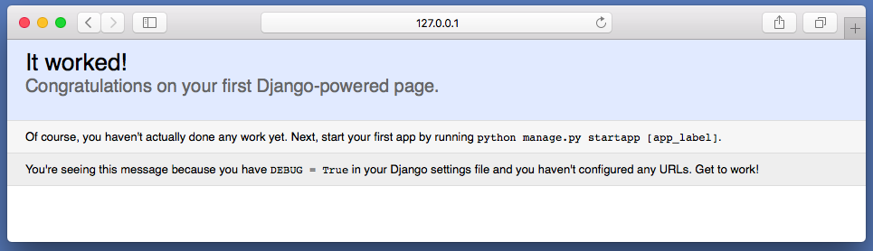

# Python全栈之路系列之Django初体验

`Django`不得不说在Python中是一个非常强大的全栈框架，而且入门也比较简单，只要你学完了基本的`Django`知识，接着再做一两个项目，不大不小就成，然后你再去学其它的框架你会发现，在那些小而美的框架中，你学起来将非常的快，因为你在学习`Django`的时候就已经学习并且体验过了Web开发流程，所以会有这么一个现象出现，有些新手朋友在学习`Flask`、`Tornado`等小而美的框架时，很多概念不是很理解，比如`ORM`、`路由`等，但你学`Django`就不会出现这种问题。

## Django的历史

`Django`是从真实世界的应用中成长起来的，它是由`堪萨斯（Kansas）州 Lawrence`城中的一个`网络开发小组`编写的。 它诞生于`2003 年秋天`，那时`Lawrence Journal-World`报纸的程序员`Adrian Holovaty`和`Simon Willison`开始用`Python`来编写程序。

当时他们的`World Online`小组制作并维护当地的几个新闻站点, 并在以新闻界特有的快节奏开发环境中逐渐发展。这些站点包括有 `LJWorld.com`、`Lawrence.com`和`KUsports.com`， 记者（或管理层） 要求增加的特征或整个程序都能在计划时间内快速的被建立，这些时间通常只有几天或几个小时。因此，`Adrian`和`Simon` 开发了一种节省时间的网络程序开发框架，这是在截止时间前能完成程序的唯一途径。

`2005年的夏天`，当这个框架开发完成时，它已经用来制作了很多个`World Online`的站点。当时`World Online`小组中的`Jacob Kaplan-Moss` 决定把这个框架发布为一个开源软件。

从今往后数年，`Django`是一个有着数以万计的用户和贡献者，在世界广泛传播的完善开源项目。原来的`World Online`的两个开发者`（Adrian and Jacob）`仍然掌握着`Django`，但是其发展方向受社区团队的影响更大。


> 摘录自djangobook3

## Django访问流程

在学习Django之前让我们先来了解下Django的访问流程把，这是很重要的，便于你理解`Django`整个的工作流程是怎样的，当然我也把图画好了，如下图所示：


解释下上面的图是如何工作的，先来拟这样一个环境，你打开了QQ空间，但是在你没有输入QQ账号和密码的情况下是不可以直接访问你的空间的，此时你需要输入账号密码才可以进入，假设你账号密码输出正确，自然而然的就进入了QQ空间，就以这个例子来描述上图的流程把：

1. 用户打开了Google浏览器，输入QQ空间的URL，但是当前没有登录，需要输入账号密码，现在输入账号密码了，然后点击登录；
2. 点击登录的这个请求首先会进入Django的路由系统（在路由前面其实还有中间件），代表你要访问哪一个资源，然后请求就被传给了对应路由的函数；
3. 这个时候函数接到了用户传过来的账号密码，去数据库中(model，信号可以实现在数据库之前之后做些操作)做匹配；
4. 当前用户名和密码正确，然后视图就会渲染页面；
5. 把页面返回给浏览器，此时用户就进入了自己的QQ空间

## 安装Python

`Django`本身是纯`Python`编写的，所以安装框架的第一步是确保你已经安装了`python2.x`或者`python3.x`，你可以在`https://www.python.org/downloads/`这下载并安装python。

我这里已经安装好了`Python3.x`

```bash
$ python3 -V
Python 3.5.2
```

## 安装

目前我的操作系统是`Mac`并且已经配置安装好了`pip3`和`python3`，我们可以直接使用`pip`来进行安装：

```bash
# 默认安装最近稳定版本
pip3 install django
```

指定安装`django`版本，这个知识虽然不是`django`内的，但还是要说一下

```python
# 指定安装1.9版本
pip install django==1.9
```

目前最新稳定的版本是`1.10`，你可以进入`Python`解释器导入`django`模块来进行校验是否正确安装

```bash
>>> import django
```

如果在导入的时候没有报错就表示已经安装成功，否则你可以需要重新安装.

```python
# 导入django
>>> import django
# 查看目前版本号
>>> django.get_version()
'1.10.5'
```

## 创建一个Django项目

`django`为我们提供了一个`django-admin`的指令，以方便与我们在命令行下创建`django`项目，可以使用`django-admin --help`查看该指令的帮助信息，当然如果你想这么做。

现在我们来看一下比较常用的一个参数把，这些参数都是通过`django-admin --help`得到的。

|参数|描述|
|:--|:--|
|startproject|创建一个完整的项目|
|startapp|创建一个app|
|runserver|运行django为我们提供的http服务|
|shell|进入待django环境的shell|
|makemigrations|生成数据库命令|
|migrate|执行生成好的数据库命令|

然后让我们使用`startproject`来创建一个项目吧

```bash
$ django-admin startproject ansheng
$ cd ansheng/
$ ls
ansheng		manage.py
```

`manage.py`文件是一种命令行工具，允许你以多种方式与该`Django`项目进行交互，输入`python manage.py help`可以看到他为我们提供了那些指定，比如如下命令都是常用的：

|指定|描述|
|:--|:--|
|createsuperuser|创建一个django后台的超级管理员|
|changepassword|修改超级管理员的密码|

貌似这两个也是最常用的，还有一个参数和上面`django-admin --help`是一样的， 请自行比较测试。

`ansheng/settings.py`该项目的全局配置文件，很重要。

`ansheng/urls.py`项目的路由配置文件，这是一个django项目的主入口文件。

还有一些其他不重要的文件就不做阐述了。

## 让Django项目运行起来

`django`内部是有一个内建的轻量的web开发服务器，在开发期间你完全可以使用内建的或者，从而免去了安装配置`nginx`或者`apache`等。

如果你还没启动服务器，请切换到你的项目目录里，运行下面的命令：

```python
$ python manage.py runserver
Performing system checks...

System check identified no issues (0 silenced).

You have 13 unapplied migration(s). Your project may not work properly until you apply the migrations for app(s): admin, auth, contenttypes, sessions.
Run 'python manage.py migrate' to apply them.
August 08, 2016 - 11:29:42
Django version 1.10, using settings 'mysite.settings'
Starting development server at http://127.0.0.1:8000/
Quit the server with CTRL-BREAK.
```

这将会在端口`8000`启动一个本地服务器, 并且只能从你的这台电脑连接和访问。 既然服务器已经运行起来了，现在用网页浏览器访问`http://127.0.0.1:8000/`。 你应该可以看到一个令人赏心悦目的淡蓝色Django欢迎页面。



更改这个`Development Server`的主机地址或端口

默认情况下，`runserver`命令在`8000`端口启动开发服务器，且仅监听本地连接。 要想要更改服务器端口的话，可将端口作为命令行参数传入：

```bash
python manage.py runserver 8080
```

通过指定一个`IP`地址，你可以告诉服务器–允许非本地连接访问。 如果你想和其他开发人员共享同一开发站点的话，该功能特别有用。`0.0.0.0`这个`IP`地址，告诉服务器去侦听任意的网络接口。

```bash
python manage.py runserver 0.0.0.0:8000
```

完成这些设置后，你本地网络中的其它计算机就可以在浏览器中访问你的`IP`地址了。比如：`http://192.168.1.103:8000/`

## 实例

这个例子中我们会涉及到`django`的多方面知识，比如后面几章会学习到的`路由`、`视图`、`模型`、`模板`、`后台管理`等知识点。

那么这是个什么例子呢？其实是一个很简单的例子，怎么个简单法儿，后台添加用户，前台展示用户，很简单吧，那我们接下来就来实操吧。

继上面创建好的项目`ansheng`之上我们在创建一个`app`叫`users`:

```bash
$ python manage.py startapp users
```

初次之外我们还需要把`app`注册到我们的项目中，可以在`ansheng/settings.py`中找到`INSTALLED_APPS`字典，把刚创建的APP名字添加进去：

```python
INSTALLED_APPS = [
	......
    'users',
]
```

因为需要用到`html`，所以我们也需要配置模板路径文件了，先创建一个存放模板文件的路径

```bash
$ mkdir templates
```

继续编辑`settings.py`，找到`TEMPLATES`，把`DIRS`修改如下：

```python
'DIRS': [os.path.join(BASE_DIR, 'templates')],
```

在`ansheng/urls.py`中添加一条路由配置:

```python
from django.conf.urls import url
from django.contrib import admin

# 导入app下面的视图函数users
from users.views import users

urlpatterns = [
    url(r'^admin/', admin.site.urls),
    # 指定路由对应的函数
    url(r'^users/$', users),
]
```

`users/views.py`视图函数内容如下：

```python
from django.shortcuts import render

# 导入模型中的UserInfo表
from .models import UserInfo

# Create your views here.

def users(request):
    # 获取所有的用户
    all_user = UserInfo.objects.all()
    # 把用户信息和前端文件一起发送到浏览器
    return render(request, 'users.html', {'all_user': all_user})
```

`template/users.html`内容如下

```html
<!doctype html>
<html lang="en">
<head>
    <meta charset="UTF-8">
    <meta name="viewport"
          content="width=device-width, user-scalable=no, initial-scale=1.0, maximum-scale=1.0, minimum-scale=1.0">
    <meta http-equiv="X-UA-Compatible" content="ie=edge">
    <title>Document</title>
</head>
<body>

<ul>
	<!-- 循环传过来的所有用户，显示其用户名 -->
    
        <li>{{ user.name }}</li>
    
</ul>

</body>
</html>
```

`users/models.py`配置文件

```python
from django.db import models

__all__ = [
    'UserInfo'
]


# Create your models here.

class UserInfo(models.Model):
    name = models.CharField(max_length=30, verbose_name='用户名')
    email = models.EmailField(verbose_name='用户邮箱')
```

`users/admin.py`配置文件

```python
from django.contrib import admin
from .models import *

# Register your models here.

# 把UserInfo注册到admin中
admin.site.register(UserInfo)
```

最后我们生成数据库：

```bash
$ python manage.py makemigrations
$ python manage.py migrate
```

创建超级管理员用户

```bash
$ python manage.py createsuperuser
# 用户名
Username (leave blank to use 'ansheng'): ansheng
# 哟箱地址，可以为空
Email address: 
# 密码
Password: 
# 确认密码
Password (again): 
Superuser created successfully.
```

打开`http://127.0.0.1:8000/admin/`登录后台，输入我们刚才创建好的用户和密码


找到我们刚才添加的`app`，然后点击`ADD`添加一个或多个用户：


继续打开`http://127.0.0.1:8000/users/`就能够看到刚才添加的用户了，你可以试着再添加一个用户然后刷新页面，看看是否会显示出来你刚刚新添加的用户，完。