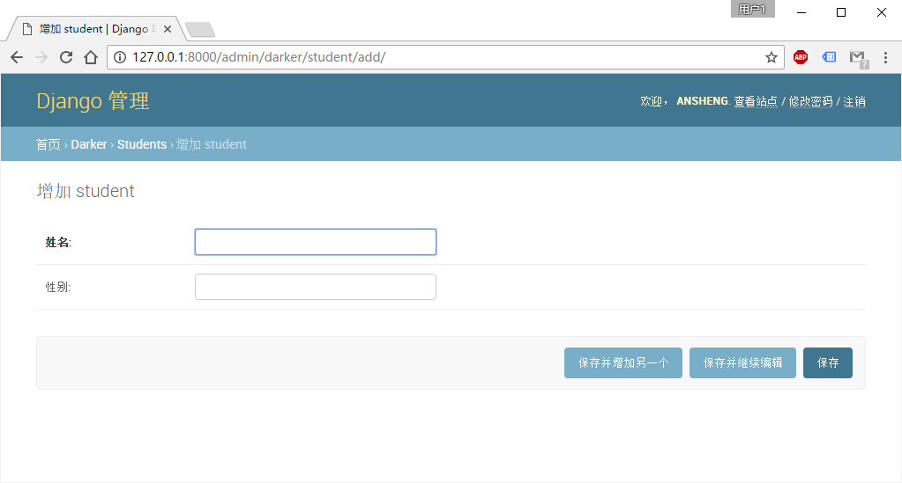
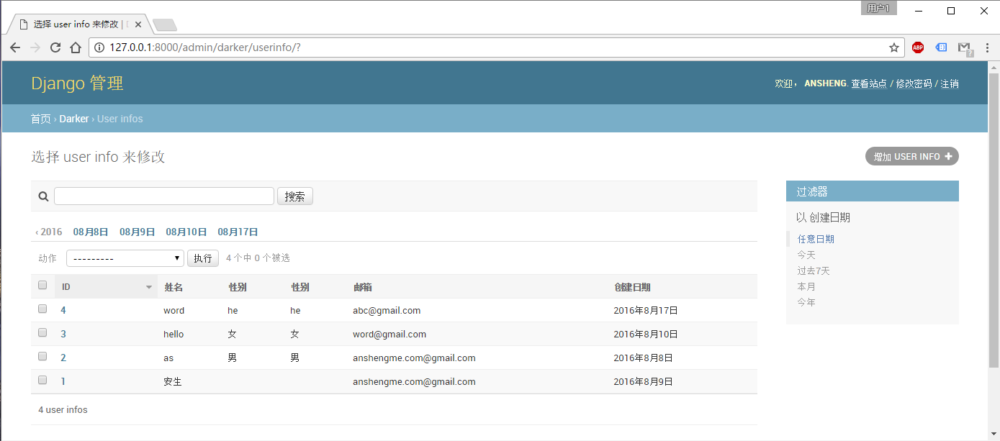
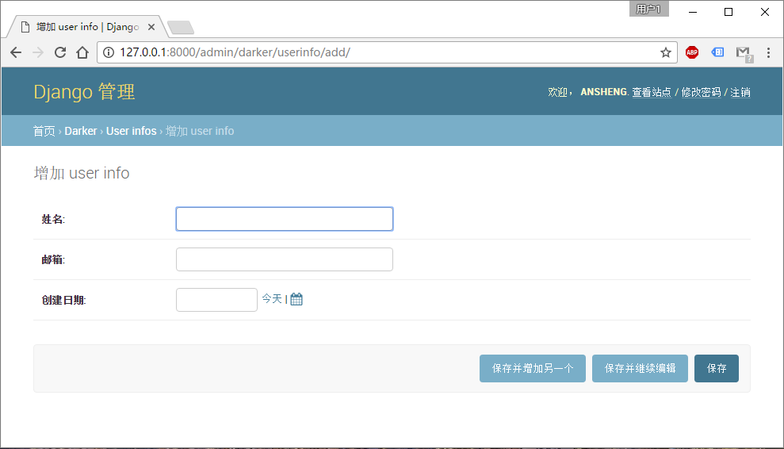

# Python全栈之路系列之Django站点管理

站点管理也称之为后台，比如说博客的后台你可以发布文章，修改文章，修改频道等信息。

Django使用极少的代码为你做了一切，在Django中创建管理界面已经不是问题，它读取你模式中的元数据，然后提供给你一个强大而且可以使用的界面，网站管理者可以用它立即工作。

## django.contrib包

Django自动管理工具是`django.contrib`的一部分。`django.contrib`是一套庞大的功能集，它是Django基本代码的组成部分，Django框架就是由众多包含附加组件(add-on)的基本代码构成的。你可以把`django.contrib`看作是可选的Python标准库或普遍模式的实际实现。它们与Django捆绑在一起，这样你在开发中就不用`重复发明轮子`了。

## 激活管理界面

Django管理站点完全是可选择的，如果你要开其它，请根据下面的步骤来操作：

打开`settings.py`文件，找到`INSTALLED_APPS`段；

`django1.10`默认已经为你开启了

```python
INSTALLED_APPS = [
    'django.contrib.admin',
    'django.contrib.auth',
    'django.contrib.contenttypes',
    'django.contrib.sessions',
    'django.contrib.messages',
    'django.contrib.staticfiles',
	'darker',
]
```

生成数据库

```bash
E:\DarkerProjects>python manage.py check
E:\DarkerProjects>python manage.py makemigrations
E:\DarkerProjects>python manage.py migrate
```

将admin配置URLconf(urls.py文件)到中

```python
urlpatterns = [
    # 默认已经开启
    url(r'^admin/', admin.site.urls),
]
```

运行Django

```python
E:\DarkerProjects>python manage.py runserver
Performing system checks...

System check identified no issues (0 silenced).
August 09, 2016 - 15:44:06
Django version 1.10, using settings 'DarkerProjects.settings'
Starting development server at http://127.0.0.1:8000/
Quit the server with CTRL-BREAK.
```

访问管理界面

打开浏览器访问`http://127.0.0.1:8000/admin`

如果配置没有问题你将会看到如下界面：


## 使用管理工具

不知你是否已经发现并没有登陆的用户名和密码？如果没有请通过如下命令创建：

```bash
E:\DarkerProjects>python manage.py createsuperuser
Username (leave blank to use 'administrator'): ansheng
Email address: anshengme.com@gmail.com
# helloword
Password:
# helloword
Password (again):
Superuser created successfully.
```

设置完成之后重新打开`http://127.0.0.1:8000/admin`页面，输入我们刚刚用户名和密码，绝壁的会登陆成功。


登陆成功之后，默认情况下她仅有两个默认的管理-编辑模块：用户组(Groups)和用户(Users)。

### 设置页面为中文

打开`settings.py`文件，找到`MIDDLEWARE`配置项：

```python
MIDDLEWARE = [
    'django.middleware.security.SecurityMiddleware',
    'django.contrib.sessions.middleware.SessionMiddleware',
    'django.middleware.common.CommonMiddleware',
    'django.middleware.csrf.CsrfViewMiddleware',
    'django.contrib.auth.middleware.AuthenticationMiddleware',
    'django.contrib.messages.middleware.MessageMiddleware',
    'django.middleware.clickjacking.XFrameOptionsMiddleware',
    'django.middleware.locale.LocaleMiddleware', # 这是新添加的内容，请确保此项在'django.middleware.clickjacking.XFrameOptionsMiddleware'后面
]
```
更改完成之后你不需要重新启动`django`也可以看到生效页面，如下图：


## 将Models加入到Admin管理中

上篇文章中我们定义了三个模块`student`、`course`和`score`

打开`darker`app目录下面的`admin.py`，内容修改为：

```python
from django.contrib import admin
from darker.models import student, course, score

# Register your models here.

admin.site.register(student)
admin.site.register(course)
admin.site.register(score)
```

完成后，打开页面`http://127.0.0.1:8000/admin`，你会看到一个DARKER区域，其中包含Courses、Scores和Students,如下图：


## Admin是如何工作的？

当服务启动时，Django从`url.py`引导URLconf，然后执行`admin.autodiscover()`语句。这个函数遍历`INSTALLED_APPS`配置，并且寻找相关的`admin.py`文件,如果在指定的app目录下找到admin.py，它就执行其中的代码。

在`darker`应用程序目录下的`admin.py`文件中，每次调用`admin.site.register()`都将那个模块注册到管理工具中,管理工具只为那些明确注册了的模块显示一个编辑/修改的界面。

应用程序`django.contrib.auth`包含自身的`admin.py` ，所以Users和Groups能在管理工具中自动显示，其它的`django.contrib`应用程序，如`django.contrib.redirects`，其它从网上下在的第三方Django应用程序一样，都会自行添加到管理工具.

综上所述，管理工具其实就是一个Django应用程序，包含自己的模块、模板、视图和URLpatterns，你要像添加自己的视图一样，把它添加到URLconf里面，你可以在Django基本代码中的django/contrib/admin目录下，检查它的模板、视图和URLpatterns，但你不要尝试直接修改其中的任何代码，因为里面有很多地方可以让你自定义管理工具的工作方式。

## 设置字段可选

只需要在列内增加如下字段，例如：

```python
gender = models.CharField(max_length=2,blank=True)
```

以上代码表示性别是可选的，如果你设置一个日期类型为空那么请设置成如下：

```python
date = models.DateField(**blank=True, null=True** )
```

## 自定义字段标签

在编辑页面中，每个字段的标签都是从模块的字段名称生成的。规则：用空格替换下划线；首字母大写。

如果你需要自定义标签，请设置如下：

```python
class student(models.Model):
    id = models.AutoField
    sname = models.CharField(max_length=12, verbose_name="姓名")
	sname = models.CharField("姓名", max_length=12)
    gender = models.CharField(max_length=2, blank=True, verbose_name="性别")
	# gender = models.CharField("性别", max_length=2, blank=True)
```
然后再次通过管理页面进行添加数据的时候将会得到如下界面：


## 自定义ModelAdmi类

请先把`admin.py`文件回滚到最初的状态并且修改`models.py`文件内容为：

```python
from django.db import models

# Create your models here.

class UserInfo(models.Model):
    id = models.AutoField
    name = models.CharField(max_length=12, verbose_name="姓名")
    gender = models.CharField(max_length=2, blank=True, verbose_name="性别")
    email = models.EmailField("邮箱")
    date = models.DateField(verbose_name="创建日期")

    def __str__(self):
        return '%s %s %s %s %s' % (self.id, self.name, self.gender, self.email, self.date)
```
然后创建数据表：
```bash
E:\DarkerProjects>python manage.py check
E:\DarkerProjects>python manage.py makemigrations
E:\DarkerProjects>python manage.py migrate
```

修改`admin.py`文件内容为：

```python
from django.contrib import admin
from darker.models import UserInfo

# Register your models here.


class AuthorAdmin(admin.ModelAdmin):
    # 列表显示的名称
    list_display = ("id", "name", "gender", "email", "date",)
	# 快速查询栏
    search_fields = ('id', 'name',)
	# 时间的过滤，它包含：今天、过往七天、当月和今年
    list_filter = ('date',)
	# 同上
    date_hierarchy = 'date'
	# 排序的时候倒序，根据ID
    ordering = ('-id',)

admin.site.register(UserInfo, AuthorAdmin)
```
因为数据库被重新初始化了，你又可以需要重置管理员密码，不过这并不重要，执行`python manage.py runserver`，登陆之后在`UserInfo`表中插入几条数据，然后就会得到如下界面：



## 自定义编辑表单

在`admin.py`文件中的`AuthorAdmin`类添加一行代码：

```python
fields = ("name", "email", "date",)
# filter_horizontal = ('authors',) 多选，filter_horizontal和filter_vertical选项只能用在多对多字段上
```

表示是再添加数据的实现显示的选项，如下图：



## 用户用户组和权限

**三个布尔型标记**

1. 活动标志，它用来控制用户是否已经激活，如果一个用户帐号的这个标记是关闭状态，而用户又尝试用它登录时，即使密码正确，他也无法登录系统。
2. 成员标志，它用来控制这个用户是否可以登录管理界面（即：这个用户是不是你们组织里的成员）由于用户系统可以被用于控制公众页面（即：非管理页面）的访问权限（详见第十四章），这个标志可用来区分公众用户和管理用户。
3. 超级用户标志，它赋予用户在管理界面中添加、修改和删除任何项目的权限，如果一个用户帐号有这个标志，那么所有权限设置（即使没有）都会被忽略。

当你创建一个用户时，它没有任何权限，该有什么权限是由你决定的，这些权限是定义在模块级别上，而不是对象级别上的。

权限管理系统也控制编辑用户和权限，如果你给某人编辑用户的权限，他可以编辑自己的权限，这种能力可能不是你希望的。 赋予一个用户修改用户的权限，本质上说就是把他变成一个超级用户。

你也可以给组中分配用户，一个组简化了给组中所有成员应用一套许可的动作，组在给大量用户特定权限的时候很有用。