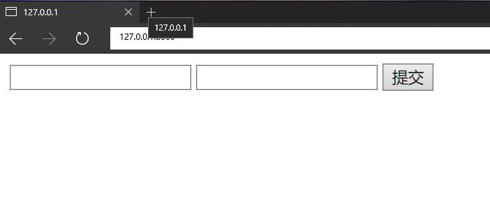

# Python全栈之路系列之Tornado的Cookie与Sess

主要的代码结构为:

```python
#!/usr/bin/env python
# _*_coding:utf-8 _*_

import tornado.ioloop
import tornado.web


class MainHandler(tornado.web.RequestHandler):
    def get(self, *args, **kwargs):
        """
        这里的代码将操作cookie与session
        """
        self.write('Hello World')


application = tornado.web.Application([
    (r'/', MainHandler),
])

if __name__ == "__main__":
    print('http://127.0.0.1:8888/')
    application.listen(8888)
    tornado.ioloop.IOLoop.instance().start()
```

## Cookie的操作

`COokie`是保存在浏览器的一个键值对，每次的HTTP请求都会携带`Cookie`。

获取所有的Cookies

```python
self.cookies
```

设置Cookie

```python
self.set_cookie(self, name, value, domain=None, expires=None, path="/", expires_days=None, **kwargs)
```

可接受的参数描述：

|参数|描述|
|:--|:--|
|`name`|Cookie的Key|
|`value`|Cookie的value|
|`domain`|生效的域名|
|`expires`|以秒为过期时间，默认从`1970-01-01T00:00:10.000Z`|
|`path`|生效路径|
|`expires_days`|以天数过期时间，如果设置为`None`则关闭浏览器Cookie就失效|

设置cookie过期时间为15分钟以后的代码为:

```python
self.set_cookie('key', 'value', expires=time.time()+900)  
```

MainHandler的代码

```python
class MainHandler(tornado.web.RequestHandler):
    def get(self, *args, **kwargs):
        # 获取cookie，如果没有获取到，值就是None
        if self.get_cookie('key', None) == None:
            # 设置一个cookie
            self.set_cookie('key', 'val')
            STRING = 'Hello World'
        else:
            # 获取cookie的值赋给STRING
            STRING = self.get_cookie('key')
        # 如果没有获取到Cookie则输出'Hello World',否则就输出Cookie的值
        self.write(STRING)
```

## 加密的Cookie

要使用加密的Cookie，你需要在创建应用时提供一个密钥，名字为`cookie_secret`, 你可以把它作为一个关键词参数传入应用的设置中：

```path
application = tornado.web.Application([
    (r'/', MainHandler),
], cookie_secret="508CE6152CB93994628D3E99934B83CC")
```

设置一个加密Cookie所需要的参数

```python
self.set_secure_cookie(self, name, value, expires_days=30, version=None, **kwargs):
```

参数和上面的大同小异。

MainHandler的代码

```python
class MainHandler(tornado.web.RequestHandler):
    def get(self, *args, **kwargs):
        # 获取cookie，如果没有获取到，值就是None
        if self.get_secure_cookie('key', None) == None:
            # 设置一个cookie
            self.set_secure_cookie('key', 'val')
            STRING = 'Hello World'
        else:
            # 获取cookie的值赋给STRING
            STRING = self.get_secure_cookie('key')
        # 如果没有获取到Cookie则输出'Hello World',否则就输出Cookie的值
        self.write(STRING)
```


### 签名的Cookie流程：

写cookie过程：

1. 将值进行base64加密
2. 对除值以外的内容进行签名，哈希算法（无法逆向解析）
3. 拼接 签名 + 加密值

读cookie过程：

1. 读取`签名 + 加密值`
2. 对签名进行验证
3. base64解密，获取值内容

## 基于Cookie的用户登陆实例

```python
# app01.py
#!/usr/bin/env python
# _*_ coding: utf-8 _*_

import tornado.web
import tornado.ioloop


class IndexHandler(tornado.web.RequestHandler):
    def get(self):
        self.set_secure_cookie('username', 'ansheng')
        self.set_secure_cookie('password', 'hello')
        self.render('index.html')

    def post(self, *args, **kwargs):
        username = self.get_argument('username', None)
        password = self.get_argument('password', None)
        cooike_user = str(self.get_secure_cookie('username'), encoding='utf-8')
        cooike_pass = str(self.get_secure_cookie('password'), encoding='utf-8')
        if username == cooike_user and password == cooike_pass:
            self.write('Hello ' + cooike_user)
        else:
            self.write('用户名或密码错误')


settings = {
    'template_path': 'template',
}

application = tornado.web.Application([
    (r'/', IndexHandler),
], **settings,
    cookie_secret="508CE6152CB93994628D3E99934B83CC")

if __name__ == '__main__':
    print('http://127.0.0.1:8000')
    application.listen(8000)
    tornado.ioloop.IOLoop.instance().start()

```

HTML文件内容

```html
<!-- index.html -->
<!DOCTYPE html>
<html lang="en">
<head>
    <meta charset="UTF-8">
</head>
<body>

<form method="post" action="/">
    <input type="text" name="username" />
    <input type="text" name="password" />
    <input type="submit" value="提交" />
</form>

</body>
</html>
```
演示结果如下：


## Session

在`Tornado`中是不提供像`Cookie`这种直接设置`Session`的，需要我们自己写插件来进行对`Session`的增删改

`Session`的数据是保存在服务端的，如果要应用`Session`必须要依赖`Cookie`，因为`Cookie`的值就等于`Session`的Key

`Session`在内存中的存储方式如下:

```python
key(随机字符串) = {
	{'k1','v1'},
	{'k2','v2'},
	{'k3','v3'},
	....
}

key(随机字符串) = {
	{'k1','v1'},
	{'k2','v2'},
	{'k3','v3'},
	....
}

key(随机字符串) = {
	{'k1','v1'},
	{'k2','v2'},
	{'k3','v3'},
	....
}

.....
```

一个设置与获取Session的小脚本:

```python
#!/usr/bin/env python
# _*_ coding: utf-8 _*_

import tornado.web
import tornado.ioloop

container = {}


class Session:
    def __init__(self, Handler):
        self.Handler = Handler
        self.random_str = None

    # 随机字符串
    def __genarate_random_str(self):
        import hashlib
        import time
        obj = hashlib.md5()
        obj.update(bytes(str(time.time()), encoding='utf-8'))
        random_str = obj.hexdigest()
        return random_str

    def __setitem__(self, key, value):
        if self.random_str == None:
            random_str = self.Handler.get_cookie('uc')
            if not self.random_str:
                random_str = self.__genarate_random_str()
                container[random_str] = {}

            else:
                if self.random_str in container.keys():
                    pass
                else:
                    random_str = self.__genarate_random_str()
                    container[random_str] = {}
            self.random_str = random_str

        container[self.random_str][key] = value
        # 浏览器写入Cookie
        self.Handler.set_cookie('uc', self.random_str)

    def __getitem__(self, key):
        random_str = self.Handler.get_cookie('uc')
        if not random_str:
            return None
        user_info_dict = container.get(random_str, None)
        if not user_info_dict:
            return None
        value = user_info_dict.get(key, None)
        return value


class BashHandler(tornado.web.RequestHandler):
    def initialize(self):
        self.session = Session(self)


class SetHandler(BashHandler):
    def get(self, *args, **kwargs):
        self.session['Hello'] = 'World'
        self.write('OK')


class GetHandler(BashHandler):
    def get(self, *args, **kwargs):
        val = self.session['Hello']
        self.write(val)


application = tornado.web.Application([
    (r'/set', SetHandler),
    (r'/get', GetHandler),
])

if __name__ == '__main__':
    print('http://127.0.0.1:8000')
    application.listen(8000)
    tornado.ioloop.IOLoop.instance().start()
```