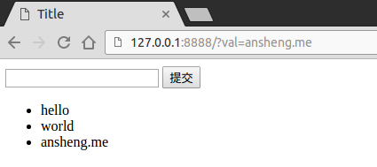
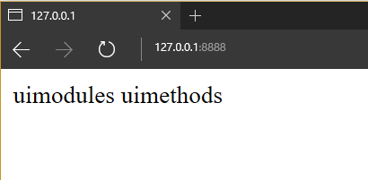
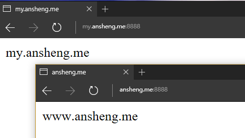

# Python全栈之路系列之Tornado Web框架

`Tornado`是一个`Python web`框架和`异步网络库`，起初由`FriendFeed`开发. 通过使用非阻塞网络I/O，`Tornado`可以支撑上万级的连接，处理`长连接, WebSockets`，和其他需要与每个用户保持长久连接的应用.

Tornado 和现在的主流 Web 服务器框架（包括大多数 Python 的框架）有着明显的区别：它是非阻塞式服务器，而且速度相当快。得利于其 非阻塞的方式和对 epoll 的运用，Tornado 每秒可以处理数以千计的连接，这意味着对于实时 Web 服务来说，Tornado 是一个理想的 Web 框架。我们开发这个 Web 服务器的主要目的就是为了处理 FriendFeed 的实时功能 ——在 FriendFeed 的应用里每一个活动用户都会保持着一个服务器连接。

通过`pip3`快速自动安装`tornado`
```bash
pip3 install tornado
```
手动源码安装
```bash
tar xvzf tornado-x.x.tar.gz
cd tornado-x.x
python setup.py build
sudo python setup.py install
```

启动一个简单的`tornado WebServer`

```python
#!/usr/bin/env python
# _*_coding:utf-8 _*_

# 导入启动一个tornado所需要的模块
import tornado.ioloop
import tornado.web

# 创建一个类,继承tornado.web.RequestHandler类
class MainHandler(tornado.web.RequestHandler):
    # 如果提交的方式是get方式,那么就执行get类
    def get(self):
        # write=返回字符串
        self.write("Hello, world")

# 路由映射系统,如果访问的路径没有在这个路由系统中,那么就报404
application = tornado.web.Application([
    # 视图,访问"/"的时候交给"MainHandler"类处理
    (r'/', MainHandler),
])

if __name__ == "__main__":
    # 监听"8888"端口
    application.listen(8888)
    # 运行socket
    tornado.ioloop.IOLoop.instance().start()
```

通过Linux下的`curl`命令访问`127.0.0.1:8888`

```bash
ansheng@Darker:~$ curl 127.0.0.1:8888
Hello, world
ansheng@Darker:~$
```

模板路径的配置

|选项|描述|调用示例|
|:--|:--|:--|
|`"tempalte_path": "template",`|HTML模板文件|`self.render("template/index.html")`|
|`"static_path": "static",`|静态文件的配置|``|
|`"static_url_prefix": "/img/",`|静态文件的前缀|``|

一个示例叫你如何使用`模板路径配置`

**python代码**

```python
#!/usr/bin/env python
# _*_coding:utf-8 _*_

import tornado.ioloop
import tornado.web

class MainHandler(tornado.web.RequestHandler):
    def get(self):
        # render=返回一个html,查找的html文件路径默认是当前路径
        self.render("template/index.html")
        # self.redirect('/URL')  # 页面跳转

settings = {
    "tempalte_path": "template",  # 模板文件
    "static_path": "static",  # 静态文件的配置
    "static_url_prefix": "/img/",  # 静态文件的前缀
}

application = tornado.web.Application([
    (r'/', MainHandler),
], **settings)

if __name__ == "__main__":
    application.listen(8888)
    tornado.ioloop.IOLoop.instance().start()
```

**html代码**

```html
<!DOCTYPE html>
<html lang="en">
<head>
    <meta charset="UTF-8">
    <title>Title</title>
</head>
<body>

<h1 style="color: rebeccapurple">Hello World!</h1>


</body>
</html>
```

`curl`一下

```bash
ansheng@Darker:~$ curl 127.0.0.1:8888
<!DOCTYPE html>
<html lang="en">
<head>
<meta charset="UTF-8">
<title>Title</title>
</head>
<body>
<h1 style="color: rebeccapurple">Hello World!</h1>

</body>
</html>
ansheng@Darker:~$
```
查看一下图片
```bash
ansheng@Darker:~$ curl -I 127.0.0.1:8888/img/logo.jpg
HTTP/1.1 200 OK
Server: TornadoServer/4.4
Etag: "cc1df4316e5f10c2aeddda15a5cad9e2"
Accept-Ranges: bytes
Last-Modified: Thu, 07 Jul 2016 01:46:10 GMT
Content-Type: image/jpeg
Date: Thu, 28 Jul 2016 14:45:14 GMT
Content-Length: 76459
```

根据用户的输入,动态的添加内容

python代码

```python
#!/usr/bin/env python
# _*_coding:utf-8 _*_

import tornado.ioloop
import tornado.web

# 全局变量INPUT_LIST,用户接收用户提交过来的值
INPUT_LIST = []

class MainHandler(tornado.web.RequestHandler):
    def get(self):
        # self.get_argument('val') 获取用户提交的数据
        val = self.get_argument('val', None)
        if val:
            # 如果获取道了数据,那么就把获取到的数据添加到全局变量INPUT_LIST中
            INPUT_LIST.append(val)
        self.render("template/index.html", input_list=INPUT_LIST)

# 1.打开"index.html"文件,读取内容(包含特殊语法)
# 2.传过来的值与特殊的语法进行一个渲染
# 3.得到已经渲染之后的字符串
# 4.返回给用户渲染之后的字符串

settings = {
    "tempalte_path": "template",  # 模板文件
}

application = tornado.web.Application([
    (r'/', MainHandler),
], **settings)

if __name__ == "__main__":
    application.listen(8888)
    tornado.ioloop.IOLoop.instance().start()
```

html代码

```html
<!DOCTYPE html>
<html lang="en">
<head>
    <meta charset="UTF-8">
    <title>Title</title>
</head>
<body>

<!-- 提交方式为get,提交到/ -->
<form method="post" action="/">
    <input type="text" name="val" />
    <input type="submit" />
</form>

<ul>
    \{\% for item in input_list \%\}
    <li>{{ item }}</li>
    \{\% end \%\}
</ul>

</body>
</html>
```



## 自定义模板语言UIMethod和UIModule

模板语言分为三大类

代码块

```html
\{\% for item in input_list \%\}
<li>{{ item }}</li>
\{\% end \%\}
```

{{ item }}
一个表达式或者一个值,例如返回的时候传入一个参数`NPM`:

```python
self.render("template/index2.html", npm="NPM")
```

前端页面接收

```html
<p>{{ npm }}</p>
```

函数处理模板(uimethods和uimodules)

```python
# uimethods.py
def mtFunc(self, arg):
    return 'uimethods'
	
# uimodules.py
from tornado.web import UIModule

class mdClass(UIModule):
    def render(self, *args, **kwargs):
        return 'uimodules'
```

注册

```python
import uimethods as mt
import uimodules as md
# 先导入上面两个模块，然后再settings字段加入以下内容
settings = {
    ........,
    'ui_methods': mt,
    'ui_modules': md,
}
```

使用

```HTML
<!-- ui_modules调用方式 -->
\{\% module mdClass() \%\}
<!-- ui_methods调用方式 -->
{{ mtFunc(val) }}
```

返回结果



## 默认的函数、字段、类

|方法|描述|
|:--|:--|
|`escape`|tornado.escape.xhtml_escape的別名|
|`xhtml_escape`|tornado.escape.xhtml_escape的別名|
|`url_escape`|tornado.escape.url_escape的別名|
|`json_encode`|tornado.escape.json_encode的別名|
|`squeeze`|tornado.escape.squeeze的別名|
|`datetime`|Python的datetime模组|
|`handler`|当前的 RequestHandler对象|
|`request`|handler.request的別名|
|`current_user`|handler.current_user的別名|
|`locale`|handler.locale的別名|
|`static_url`|handler.static_url的別名,对静态文件做缓存|
|`xsrf_form_html`|handler.xsrf_form_html的別名|

## 路由

基于正则的路由

```python
class MainHandler(tornado.web.RequestHandler):
    def get(self, *args, **kwargs):
        print(args)
        self.write("Hello Wrold")

application = tornado.web.Application([
    # 在路由中可以写入正则表达式
    (r'/(\d*)/(\w*)', MainHandler),
    (r'/(?P<number>\d*)/(?P<nid>\w*)', MainHandler),
])
```

二级域名的路由

二级域名这个功能实在`Tornado`中特有的，实现的代码为：

```python
class WwwHandler(tornado.web.RequestHandler):
    def get(self):
        self.write("www.ansheng.me")


class MyHandler(tornado.web.RequestHandler):
    def get(self):
        self.write("my.ansheng.me")


application = tornado.web.Application([
    (r'/', WwwHandler),
])

application.add_handlers('my.ansheng.me$', [
    (r'/', MyHandler)
])
```

本机的hosts文件内加入以下内容:

```bash
127.0.0.1 www.ansheng.me
127.0.0.1 my.ansheng.me
```

效果图



## 模板的继承与导入

继承

```html
<!-- layout.html -->
<!DOCTYPE html>
<html>
<head>
    <meta http-equiv="Content-Type" content="text/html; charset=UTF-8"/>
    <link href="{{static_url("css/common.css")}}" rel="stylesheet" />
    \{\% block CSS \%\}\{\% end \%\}
</head>
<body>
    <div class="pg-header">

    </div>
    \{\% block RenderBody \%\}\{\% end \%\}
    <script src="{{static_url("js/jquery-1.8.2.min.js")}}"></script>
    \{\% block JavaScript \%\}\{\% end \%\}
</body>
</html>

<!-- index.html -->
\{\% extends 'layout.html'\%\}
\{\% block CSS \%\}
    <link href="{{static_url("css/index.css")}}" rel="stylesheet" />
\{\% end \%\}
\{\% block RenderBody \%\}
    <h1>Index</h1>
    <ul>
    \{\%  for item in li \%\}
        <li>{{item}}</li>
    \{\% end \%\}
    </ul>
\{\% end \%\}
\{\% block JavaScript \%\}
\{\% end \%\}
```

导入

```html
<!-- header.html -->
<div>
    <ul>
        <li>1024</li>
        <li>42区</li>
    </ul>
</div>

<!-- index.html -->
<!DOCTYPE html>
<html>
<head>
    <meta http-equiv="Content-Type" content="text/html; charset=UTF-8"/>
    <link href="{{static_url("css/common.css")}}" rel="stylesheet" />
</head>
<body>
    <div class="pg-header">
        \{\% include 'header.html' \%\}
    </div>
    <script src="{{static_url("js/jquery-1.8.2.min.js")}}"></script>
</body>
</html>
```