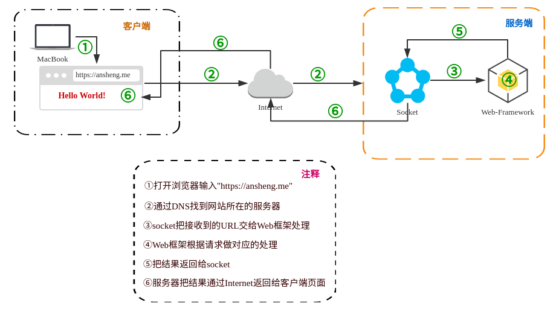

# Python全栈之路系列之Web框架介绍

所有的语言`Web框架`本质其实就是起一个`socket`服务端,监听一个端口,然后运行起来

`Web框架`包含两部分,一部分是`socket`,另外一部分是业务的逻辑处理,根据请求的不同做不同的处理

Python的`Web框架`分成了两类,

1. 即包含socket也包含业务逻辑处理的(tornado)
2. 不包含socket(框架本身通过第三方模块实现socket)只包含业务逻辑处理(django,Flask)

`WSGI`的全称是`Web Server Gateway Interface`，翻译过来就是Web服务器网关接口。具体的来说，WSGI是一个规范，定义了Web服务器如何与Python应用程序进行交互，使得使用Python写的Web应用程序可以和Web服务器对接起来。WSGI一开始是在PEP-0333中定义的，最新版本是在Python的PEP-3333定义的。



下面实例的代码中`RunServer()`函数就是符合WSGI标准的一个HTTP处理函数，它接收两个参数：

1. `environ`：一个包含所有HTTP请求信息的dict对象;
2. `start_response`：一个发送HTTP响应的函数;

**通过`wsgiref`模块实现一个自定义的`web框架`**

代码的大概逻辑就是: 定义了两个函数`index()`和`manage()`,如果用户访问的URL是`127.0.0.1:8000/index`就返回`<h1>/index</h1>`,如果用户访问的是`127.0.0.1:8000/manage`就返回`/manage`,如果访问其他页面就返回`404`

```Python
#!/usr/bin/python2
# _*_coding:utf-8 _*_
from wsgiref.simple_server import make_server

def index(arg):
    # 返回一个含有html代码的字符串
    return "<h1>%s</h1>" %(arg)

def manage(arg):
    return arg

URLS = {
    "/index": index,
    "/manage": manage,
}

def RunServer(environ, start_response):
    start_response('200 OK', [('Content-Type', 'text/html')])
    url = environ['PATH_INFO']
    if url in URLS.keys():
        func_name = URLS[url]
        ret = func_name(url)
    else:
        ret = "404"
    return ret

if __name__ == '__main__':
    httpd = make_server('', 8000, RunServer)
    httpd.serve_forever()
```
通过本机的curl命令去访问测试
```bash
ansheng@Darker:~$ curl 127.0.0.1:8000/index
<h1>/index</h1>
ansheng@Darker:~$ curl 127.0.0.1:8000/asdasd
404
ansheng@Darker:~$ curl 127.0.0.1:8000/manage
/manage
```

无论多么复杂的Web应用程序，入口都是一个`WSGI`处理函数。HTTP请求的所有输入信息都可以通过`environ`获得，HTTP响应的输出都可以通过`start_response()`加上函数返回值作为Body,复杂的Web应用程序，光靠一个WSGI函数来处理还是太底层了，我们需要在WSGI之上再抽象出Web框架，进一步简化Web开发。

## MVC and MTV

MVC模式就是架构模式的一种，MVC模式的目的是实作一种动态的程式设计，使后续对程式的修改和扩充功能简化，并且使程式某一部分的重复利用成为可能。除此之外，此模式通过对复杂度的简化，使程式结构更加直觉。


软体系统通过对自身基本部分分离的同时也赋予了各个基本部分应有的功能。专业人员可以通过自身的专长分组：
1. `控制器Controller` - 负责转发请求，对请求进行处理;
2. `视图View` - 介面设计人员进行图形介面设计;
3. `模型Model` - 程式设计师编写程式应有的功能（实作演算法等等）、资料库专家进行资料管理和资料库设计（可以实作具体的功能）;


MVC中的`M`是代表`MODLE层`,`V`代表`VIEW`层,C代表`Contrl`层.
MTV中的`M`是代表`MODLE层`,`T`代表`Template(模板层)`,`V`代表`VIEW`层.