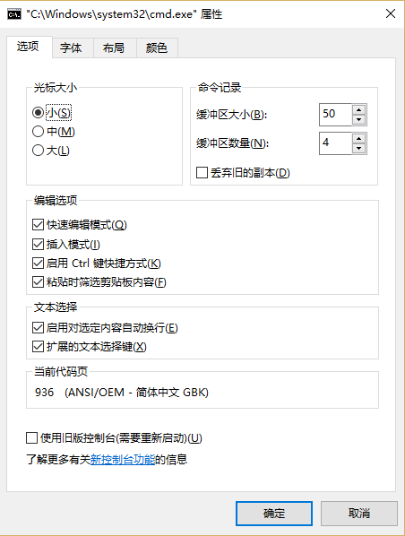
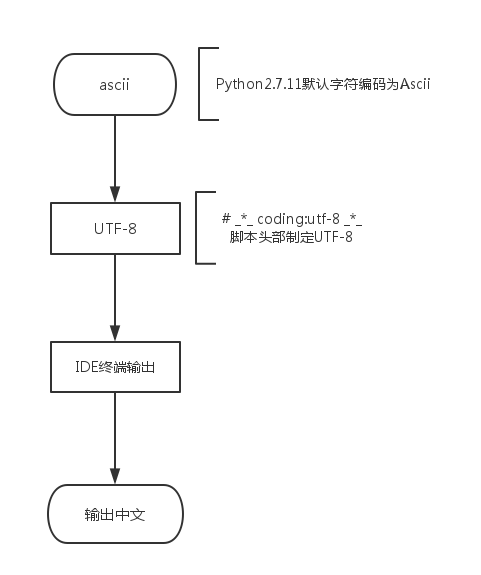
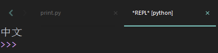
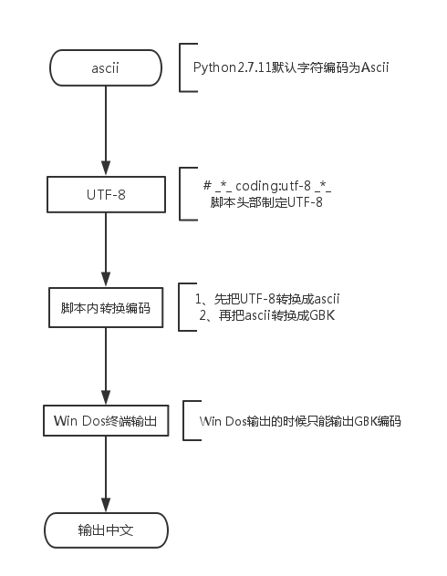
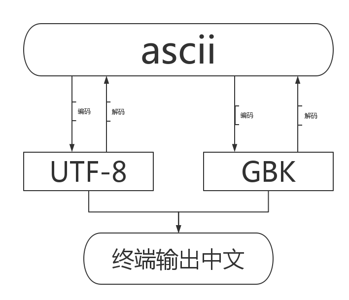

# Python全栈之路系列之Win字符编码深解

## Win下的dos窗口输出中文

`Python2.7`默认字符编码是`ascii`格式，即使指定字符编码为UTF-8也未必能够输出中文，测试如下：

```python
#_*_coding:utf-8_*_

# 定义一个变量内容为中文，字符集为UTF-8
temp = "中文"

# 输出变量temp的内容
print(temp)
```


用win下的dos窗口执行这个脚本，看看输出出来的是否为中文
```shell
C:\Users\anshe>python F:\Python_code\sublime\Day02\print.py
涓枃		#输出出来的是乱码
```
这是为什么呢?其实是因为dos窗口的字符编码是`GBK`的（如下图），规定输出的字符集必须是GBK的，所以输出出来的中文即为乱码。

注意我是用的是`Python2.7.11`
```shell
C:\Users\anshe>python -V
Python 2.7.11
```
使用`Pycharm`或者`sublime`的`Python IDE`输出中文流程


流程中文说明：
`Py Scripts头部指定编码格式为UTF-8` --> `IDE把默认的Ascii格式编码成UTF-8` ---> `IDE终端输出中文`

- 用sublime IDE输出

```python
# _*_ coding:utf-8 _*_

# 定义一个变量内容为中文，字符集为UTF-8
temp = "中文"

# 输出变量temp的内容
print(temp)
```
输出的内容：

既然这样，python的编码能够把`ascii`编码还换成`UTF-8`那么肯定也就可以转换成`GBK`编码，流程如下：

代码如下：
```python
# _*_ coding:utf-8 _*_

# 定义一个变量内容为中文，字符集为UTF-8
temp = "中文"

# 解码，需要指定原来是什么编码
temp_unicode = temp.decode("utf-8")

# 编码，需要指定要转换成什么编码
temp_gbk = temp_unicode.encode("gbk")

# 输出转换成的gbk编码
print(temp_gbk)
```
Dos窗口执行测试：
```python
C:\Users\anshe>python F:\Python_code\sublime\Day02\print.py
中文
```
另外一种方法：
代码:
```shell
# _*_ coding:utf-8 _*_

# 定义一个变量内容为中文，字符集为UTF-8
temp = "中文"

# 解码，需要指定原来是什么编码
temp_unicode = temp.decode("utf-8")

# 输出转换成的gbk编码
print(temp_unicode)
# Windows终端需要GBK，DOS自动转换成GBK
```
```shell
C:\Users\anshe>python F:\Python_code\sublime\Day02\print.py
中文
```
大概流程也就像下面的图一样

python3移除了unicode字符集的类型，默认使用UTF-8，还有一种也可以在dos终端输出中文的方法，代码如下：
```python
# _*_ coding:utf-8 _*_

print(u"中文")
```
DOs窗口输出的就是中文了，虽然我也不知道是什么意思
```shell
C:\Users\anshe>python f:\Python_code\sublime\Day02\print.py
中文
```