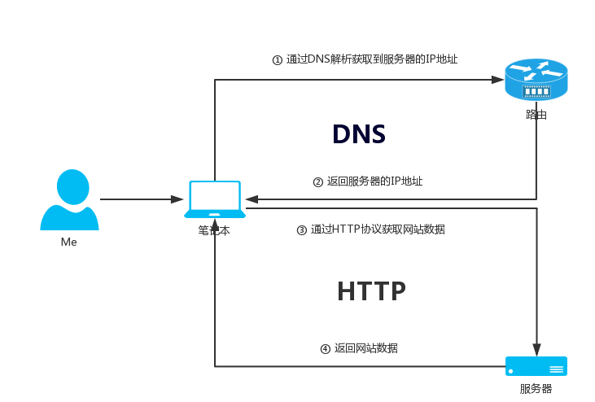

# 通过浏览器访问一个网站的背后到底经历了什么

## 前言

来吧，随我一起来整理下HTTP与DNS协议吧，无论你是Dev or Ops这些都是你必须要知道的基础网络知识，如上图所示，我们把用户访问网站的流程大概分为了两大部分：

1. DNS(用于解析域名的IP地址)
2. HTTP(得到IP地址之后从服务器获取数据)

基于上面的两个点，就让我么来深刻的讨论下到底什么是DNS and HTTP把。



## What is DNS?

域名系统（Domain Name System，缩写：DNS）是互联网的一项服务。它作为将域名和IP地址相互映射的一个分布式数据库，能够使人更方便地访问互联网。DNS使用TCP和UDP端口53。当前，对于每一级域名长度的限制是63个字符，域名总长度则不能超过253个字符。


> 来自[维基百科](https://zh.wikipedia.org/wiki/%E5%9F%9F%E5%90%8D%E7%B3%BB%E7%BB%9F)

### DNS原理

如上所示，DNS实则就是把一个域名转换成了IP(A记录)地址(虽然这只是其中的一部分)，那么它是怎么转换的呢？为了理解这么个东东，我们还是画张图来更好的理解它把，如下图所示：


当用户在浏览器输入`http://blog.ansheng.me`，是如何得到对应服务器的IP地址呢？具体步骤如下：

1. 浏览器会在本地的缓存中查找是否存在当前访问域名的缓存，如果有就返回数据，否则就继续第二步，通常情况下浏览器都会缓存网站的数据，为了就是加速访问；
2. 查看当前操作系统的`hosts`文件是否写有IP和域名对应的关系，如果有则得到IP地址，否则继续第三步；
3. 通过本地的Local DNS获取域名对应的IP地址，那么Local DNS其实就是我们的交换机或者路由器配置的DNS，通常情况下都有两个，一个主一个辅；
4. Local DNS会先看缓存DNS中是否有这条记录，如果没有就继续往下走，否则就返回IP地址；
5. Local DNS会继续请求根服务器(`.`)，根服务器全球只有十三台，根服务器也没有**blog.ansheng.me**域名的解析，但是根有**.me**域名的解析，然后根就会继续发起请求，当然只有在转发模式下才会这么做。
6. 根服务器请求**.me**服务器有没有**blog.ansheng.me**域名的解析，**.me**服务器服务器没有对应的解析，但是我有**ansheng.me**域名的解析，然后由**.me**服务器继续发起请求；
7. **.me**DNS服务器问**ansheng.me**DNS服务器有没有**blog.ansheng.me**域名的解析，**ansheng.me**DNS服务器说我有**blog.ansheng.me**域名的解析；
8. **ansheng.me**DNS服务器把**blog.ansheng.me**域名解析的IP地址返回给，**.me**DNS服务器；
9. **.me**DNS服务器把记录返回给根服务器；
10. 根服务器把记录返回给Local DNS服务器
11. Local DNS服务器会把记录还存在DNS Cache服务器上，并且把记录再次返回给浏览器；
12. 浏览器得到了对应的IP地址后就向**blog.ansheng.me**对应的服务器发起HTTP请求；
13. **blog.ansheng.me**服务器经过一些列的处理，最后把数据返回给浏览器，最后在页面上展示；

- 下面是未启用转发模式工作流程


1. **Local DNS**服务器向**根**服务器发起请求问有没有**blog.ansheng.me**域名的解析记录；
2. **根**服务器说我没有**blog.ansheng.me**域名的解析记录，但是我有**.me**的解析记录，并且把**.me**的解析记录返回给**Local DNS**服务器；
3. **Local DNS**服务器得到*.me**的服务器IP之后发起请求问：你有没有**blog.ansheng.me**域名的解析记录；
4. **.me**服务器说我没有，但是我有**ansheng.me**域名的解析记录，并且把IP地址返回给**Local DNS**服务器；
5. **Local DNS**服务器得到**ansheng.me**的服务器IP之后又发起请求问：你有没有**blog.ansheng.me**域名的解析记录；
6. **ansheng.me**的服务器说我有**blog.ansheng.me**域名的解析记录，并且把对应解析的记录返回给**Local DNS**服务器

不管用的是转发模式，还是根提示，最后都是把结果返回给Local DNS服务器，由此DNS服务器再返回给客户机。

> 从浏览器到本地DNS服务器是属于递归查询，而DNS服务器之间就是的交互查询就是迭代查询


通过`dig`命令可以很清楚的看到解析流程：

```bash
[root@ansheng ~]# dig +trace blog.ansheng.me

; <<>> DiG 9.8.2rc1-RedHat-9.8.2-0.47.rc1.el6_8.1 <<>> +trace blog.ansheng.me
;; global options: +cmd
.                       4695    IN      NS      a.root-servers.net.
.                       4695    IN      NS      b.root-servers.net.
.                       4695    IN      NS      c.root-servers.net.
.                       4695    IN      NS      d.root-servers.net.
.                       4695    IN      NS      e.root-servers.net.
.                       4695    IN      NS      f.root-servers.net.
.                       4695    IN      NS      g.root-servers.net.
.                       4695    IN      NS      h.root-servers.net.
.                       4695    IN      NS      i.root-servers.net.
.                       4695    IN      NS      j.root-servers.net.
.                       4695    IN      NS      k.root-servers.net.
.                       4695    IN      NS      l.root-servers.net.
.                       4695    IN      NS      m.root-servers.net.
;; Received 228 bytes from 8.8.8.8#53(8.8.8.8) in 62 ms

me.                     172800  IN      NS      ns.nic.me.
me.                     172800  IN      NS      a2.me.afilias-nst.info.
me.                     172800  IN      NS      d0.cctld.afilias-nst.org.
me.                     172800  IN      NS      ns2.nic.me.
me.                     172800  IN      NS      b2.me.afilias-nst.org.
me.                     172800  IN      NS      c0.cctld.afilias-nst.info.
me.                     172800  IN      NS      a0.cctld.afilias-nst.info.
me.                     172800  IN      NS      b0.cctld.afilias-nst.org.
;; Received 491 bytes from 202.12.27.33#53(202.12.27.33) in 678 ms

ansheng.me.             86400   IN      NS      dns10.hichina.com.
ansheng.me.             86400   IN      NS      dns9.hichina.com.
;; Received 83 bytes from 199.254.61.1#53(199.254.61.1) in 86 ms

blog.ansheng.me.        600     IN      A       104.224.139.81
;; Received 49 bytes from 140.205.228.13#53(140.205.228.13) in 182 ms
```

## What is HTTP?

超文本传输协议（英文：HyperText Transfer Protocol，缩写：HTTP）是互联网上应用最为广泛的一种网络协议。设计HTTP最初的目的是为了提供一种发布和接收HTML页面的方法。通过HTTP或者HTTPS协议请求的资源由统一资源标识符（Uniform Resource Identifiers，URI）来标识。

> 来自[维基百科](https://zh.wikipedia.org/wiki/%E8%B6%85%E6%96%87%E6%9C%AC%E4%BC%A0%E8%BE%93%E5%8D%8F%E8%AE%AE)

### HTTP报文

HTTP报文有两种：

1. 请求报文(Request Message)，客户端向服务端发起的请求
2. 响应报文(Response Message)，服务端回应给客户端的请求

请求报文(Request Message)

|报文|信息|
|:--|:--|
|请求行|告诉服务器我使用HTTP1.1的协议获取(GET)`/index.html`这个资源|
|请求头|请求头由Key/Value组成，请求头部分的作用是客户端把请求的相关信息告诉服务器|
|空行|告诉服务器下面没有请求头的信息了|
|请求报文主体段|主体部分包含了要发给服务器的数据|

响应报文(Response Message)

|报文|信息|
|:--|:--|
|起始行|协议及版本号，数字状态码，状态信息|
|响应头部|Key/Value组成|
|空行|告诉服务器下面没有响应头的信息了|
|请求报文主体段|一段字符串(例如：HTML)|

### 原理图

下面的图是通过`fiddler`软件抓取的到请求头和响应头：


在上面截图中我们可以看到请求头部分：

```bash
# 请求行
GET https://www.ansheng.me/ HTTP/1.1
# 请求头
Host: www.ansheng.me
Connection: keep-alive
Pragma: no-cache
Cache-Control: no-cache
Upgrade-Insecure-Requests: 1
User-Agent: Mozilla/5.0 (Windows NT 10.0; Win64; x64) AppleWebKit/537.36 (KHTML, like Gecko) Chrome/55.0.2868.3 Safari/537.36
Accept: text/html,application/xhtml+xml,application/xml;q=0.9,image/webp,*/*;q=0.8
Accept-Encoding: gzip, deflate, sdch, br
Accept-Language: zh-CN,zh;q=0.8
Cookie: _gat=1; _ga=GA1.2.1463852464.1476801026
# 因为是GET方法，所以就没有请求报文主体
```

响应头：

```bash
# 起始行
HTTP/1.1 200 OK
# 响应头部
Server: nginx
Date: Tue, 18 Oct 2016 17:22:35 GMT
Content-Type: text/html; charset=utf-8
Last-Modified: Sun, 02 Oct 2016 05:51:17 GMT
Transfer-Encoding: chunked
Connection: keep-alive
Vary: Accept-Encoding
ETag: W/"57f0a055-9fc"
Expires: Fri, 21 Oct 2016 17:22:35 GMT
Cache-Control: max-age=259200
Content-Encoding: gzip
# 空行

# 请求报文主体段，在浏览器是不会乱码的
2da
       V n 0 W ; F S    M, R HH Q   L      ܹ   5  l	  v և ? } y2 $ y     s     [ {   , _s/. wɄ vi{
      q	  8

*** FIDDLER: RawDisplay truncated at 128 characters. Right-click to disable truncation. ***
```