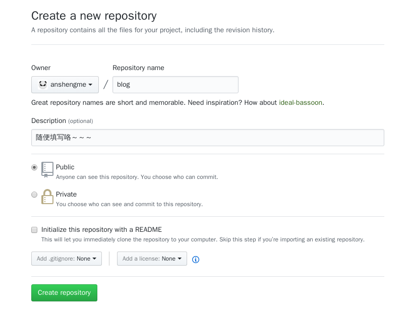
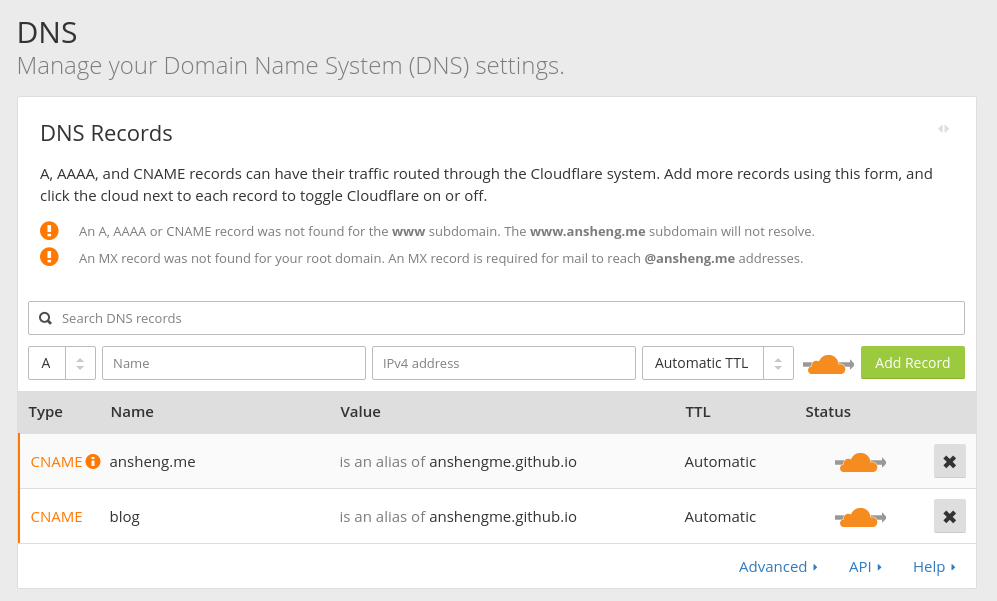
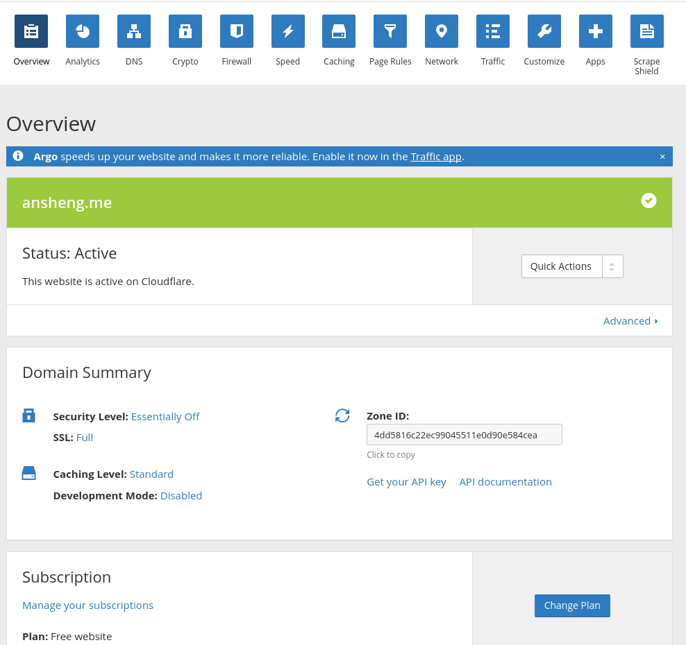
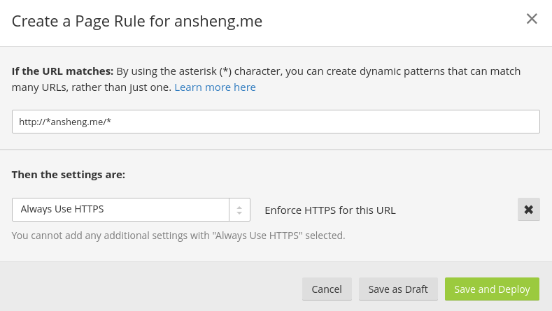
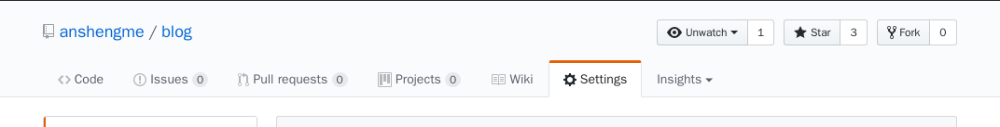

# 使用GitHub做个人博客

---

## 前言

用过市面上主流的`blog`程序，也用`Django`自己写过开源的博客程序[July](https://github.com/anshengme/July)(170+Star)，慢慢的发现没太多精力去打理维护，干脆直接放`GitHub`当静态页面算了，之前也用过`Hexo`、`jekyll`等静态程序，但使用起来还是繁琐，体验不到写作的乐趣。

所以，干脆直接放`GitHub`把，简单粗暴，你可能只需要做一件事情，就是准备好一个`GitHub`账号，再准备一个域名，不论备案与否。

## 创建GitHub仓库

假设你已经有`GitHub`账号，如果还没有[点我注册](https://github.com/join?source=header-home),登录你的账号，创建一个仓库



仓库名、描述等信息，填写一个你喜欢的就好。

```bash
# 下载创建好的仓库
$ git clone https://github.com/anshengme/blog.git
$ cd blog/
$ echo 'Hello, Ansheng!' > README.md
# 绑定的域名
$ echo 'blog.ansheng.me' > CNAME
$ git add .
$ git commit -a -m "2017-05-26 23:19:08"
# 提交到仓库中
$ git push
```

这时候访问你的`用户名`+`github.io/blog`应该就能出现`Hello, Ansheng!`字样，但这并不是我们想要的，我想直接访问`blog.ansheng.me`就出现想要的结果，应该怎么做呢？

## 域名绑定

上步骤在仓库中的`CNAME`写入了`blog.ansheng.me`，其实我们只需要在自己的域名管理后台添加一条`cname`记录指向到`anshengme.github.io`就可以了，如下图所示：



我添加了两条记录，`@`和`blog`，因为我启动了`ansheng.me`和`blog.ansheng.me`。

## HTTPS跳转

这里我使用的是`Cloudflare`提供的免费CDN服务,并且开启`HTTPS`以及`HTTP2`,只是为了一个小绿锁，目测现在大部分的站点都已经开启了，不用总感觉哪里不对劲（档次低）。

假设你已经注册了`Cloudflare`账号，也已经绑定了你的域名，注意，这里绑定域名的时候需要把`Nameserver`指向`Cloudflare`所提供的，不然不能提供`CDN`服务，比如我的域名在`阿里云`买的，但是把`NS`改成`Cloudflare`的了


如果你已经将NS指向到了`Cloudflare`中，请确保你的域名状态如下所示



域名状态一定要是`Active`才可以哦。

### 开启SSL

在`Cloudflare`的站点管理页面，切换到`Crypto`这个标签页。将`SSL`的模式改为`full`


开启之后稍等片刻你就可以通过`https`进行访问了，但是你会发现当访问`http`的时候并不会自动跳转到`https`，所以，你可能还需要下面的操作。

### 强制跳转到HTTPS

切换到`Page Rules`页，添加一条页面规则



> http://\*ansheng.me/*

填写完毕之后点击`Save and Deploy`就可以了，可能需要一段时间，毕竟有缓存。

## 遇到的坑

想过使用阿里云的CDN做强制HTTPS跳转，但巨麻烦，因为阿里云在跳转的时候不能与原域名重复，所以，每个https域名都必须做两条记录，而且配置的CDN不知道什么时候神效，我前天晚上登录两三个小时都没生效，所以直接换`Cloudflare`了，免费的把，只要是这。

```bash
$ curl -I https://blog.ansheng.me
HTTP/2 200 
date: Fri, 26 May 2017 15:52:54 GMT
content-type: text/html; charset=utf-8
set-cookie: __cfduid=d76f0ba8019b6ca9aecc7420de5e6ac5c1495813974; expires=Sat, 26-May-18 15:52:54 GMT; path=/; domain=.ansheng.me; HttpOnly
last-modified: Fri, 26 May 2017 05:58:36 GMT
access-control-allow-origin: *
expires: Fri, 26 May 2017 12:10:36 GMT
cache-control: max-age=600
x-github-request-id: 9196:1FDB:577B6E:7848FF:592818E4
via: 1.1 varnish
age: 5
x-served-by: cache-sjc3646-SJC
x-cache: HIT
x-cache-hits: 1
x-timer: S1495813974.473891,VS0,VE1
vary: Accept-Encoding
x-fastly-request-id: 2dc90b55edced17846d414909da9b20e89fdcccc
server: cloudflare-nginx
cf-ray: 3651e77c68d96bfe-SJC
```

上面是CDN服务器返回的数据，真的是支持HTTP2了，虽然访问还是慢之类的，但是不用操心续费了。

还有一个就是如果你写的`.md`文件格式有错误是可以在下面的页面看到的




如果你每次上传的`.md`文件格式没什么错误的话会提示你` Your site is published at http://blog.ansheng.me/`，如果格式错了，会直接提示你那个文件第几行出现语法错误，还是很智能的。

## 总结

作为一名程序员，使用`Markdown`写作是标配了，用了之后你会发现真的是太棒了。

最后，推荐[Python全栈之路系列文章](https://github.com/anshengme/blog/blob/master/article/python-full-stack-way.md)文章，用来做`Python`入门还是很不错的。
