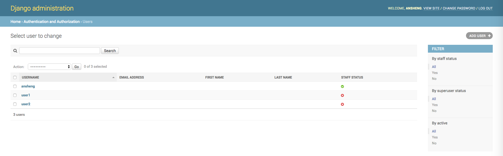
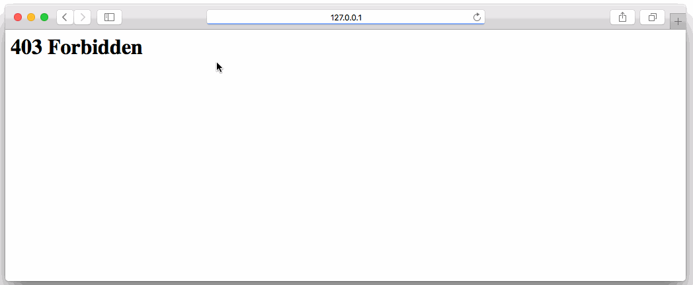

# 为你的Django视图使用装饰器

视图装饰器可用于限制对某些视图的访问，Django附带一些内置的装饰，如`login_required`，`require_POST`或`has_permission`，它们非常有用，但有时您可能需要以不同的粒度级别限制访问，例如只允许创建模型条目的用户编辑或删除它。

一个简单的方法来解决这个问题，没有在每个函数里面添加一个if语句，就是写一个自定义的装饰器。

## 示例

首先我们需要创建一个项目，名为`view_decorators`:

```bash
$ django-admin startproject view_decorators
```

在某个项目下创建一个名为`blog`的应用程序。

```bash
$ cd view_decorators/
$ python3 manage.py startapp blog
```

`blog/models.py`

```python
from django.db import models
from django.contrib.auth.models import User


# Create your models here.

class Article(models.Model):
    title = models.CharField(max_length=255, verbose_name='标题')
    create_by = models.ForeignKey(User, verbose_name='用户')
    create_date = models.DateTimeField(auto_created=True, verbose_name='创建时间')

    class Meta:
        verbose_name = '文章'
        verbose_name_plural = verbose_name

    def __str__(self):
        return self.title

```

创建装饰器模块

编辑`blog/decorators.py`文件中创建一个名为`user_is_article_author`的装饰器

```python
#!/use/bin/env python
# _*_ coding:utf-8 __

from django.core.exceptions import PermissionDenied
from .models import Article


def user_is_article_author(function):
    def wrap(request, *args, **kwargs):
        article = Article.objects.get(id=kwargs['article_id'])
        if article.create_by == request.user:
            return function(request, *args, **kwargs)
        else:
            raise PermissionDenied

    wrap.__doc__ = function.__doc__
    wrap.__name__ = function.__name__
    return wrap
```

`blog/views.py`

```python
from django.contrib import messages
from django.contrib.auth.decorators import login_required
from django.shortcuts import render, get_object_or_404, redirect

from .models import Article
from .decorators import user_is_article_author


# Create your views here.

@login_required
def index(request):
    # 获取所有的文章列表
    articles = Article.objects.all()
    return render(request, 'index.html', {'articles': articles})


@login_required
@user_is_article_author
def remove(request, article_id):
    # 如果查询不到文章，则直接抛出异常
    article = get_object_or_404(Article, id=article_id)
    # 删除成功之后的提示信息
    message = '文章：{0}，删除成功'.format(article.title)
    # 删除文章
    article.delete()
    # 把message添加到request
    messages.success(request, message)
    # 转到index函数
    return redirect('index')
```

`templates/index.html`

```html
<!doctype html>
<html lang="en">
<head>
    <meta charset="UTF-8">
    <meta name="viewport"
          content="width=device-width, user-scalable=no, initial-scale=1.0, maximum-scale=1.0, minimum-scale=1.0">
    <meta http-equiv="X-UA-Compatible" content="ie=edge">
    <title>Document</title>
    <link rel="stylesheet" href="https://cdnjs.cloudflare.com/ajax/libs/materialize/0.97.8/css/materialize.min.css">
</head>
<body>

<table class="striped">
    <thead>
    <tr>
        <th>创建用户</th>
        <th>文章标题</th>
        <th>创建时间</th>
        <th>操作</th>
    </tr>
    </thead>
    <tbody>
    
        <tr>
            <td>{{ article.create_by }}</td>
            <td>{{ article.title }}</td>
            <td>{{ article.create_date }}</td>
            <td>
                <form action="" method="post">
                    
                    <input type="submit" value="删除" class="btn">
                </form>
            </td>
        </tr>
    
    </tbody>
</table>

    
    <div class="card-panel teal lighten-2">{{ message }}</div>


</body>
</html>
```

`blog/admin.py`

```python
from django.contrib import admin
from .models import Article

# Register your models here.

admin.site.register(Article)
```

`view_decorators/urls.py`

```python
from django.conf.urls import url
from django.contrib import admin
from blog.views import index, remove

urlpatterns = [
    url(r'^admin/', admin.site.urls),
    url(r'^blog/$', index, name='index'),
    url(r'^blog/remove/(?P<article_id>\d+)/$', remove, name='remove'),
]
```

由于使用了`@login_required`装饰器，我们还需要在`settings.py`文件中定义`LOGIN_URL`参数：

```python
# 未登录的用户跳转到后台登录页面，登录成功之后再跳转回之前的页面
LOGIN_URL = '/admin/login/'
```

生成数据库并创建超级用户

```bash
$ python3 manage.py makemigrations
$ python3 manage.py migrate
# 创建的超级用户账号为ansheng密码为ansheng.me
$ python3 manage.py createsuperuser
```

打开`http://127.0.0.1:8000/admin/`页面，输入刚才创建好的超级管理员账号与密码，登录进去之后创建两个用户，密码随意：



退回上一级页面，添加三篇文章


我们刚才看到有三个用户，所以呢，需要创建三篇文章，每篇文章对应一个用户


打开`http://127.0.0.1:8000/blog/`页面，试着删除不是其他用户的文章，看看是什么结果。

